# CycleArc

**Your Codex, Claude and Cursor limits, one click away.**

A native Windows tray app for checking Codex, Claude and Cursor profiles, remaining percentages and reset times. Codex accounts also show reset credits when available.

The **Codex**, **Claude** or **Cursor** label on account cards, selected details, tray tooltips and the widget identifies the usage provider. Connect the current Claude login or sign in through the official browser flow; CycleArc can actively check the shared Claude quota through the connected Desktop login and keeps **statusLine** and Desktop history as fallback sources. See [Claude Code connection](#claude-code-connection) and [Cursor connection](#cursor-connection). Gemini is not supported.

> **Codex:** five-hour and weekly limits appear when the official App Server reports them, including on Plus; display is not restricted by plan name. Missing windows are omitted and unknown percentages stay unknown. **Claude:** manual and scheduled refreshes first try a read-only quota check through the connected Desktop login; statusLine and Claude Desktop subscription history remain fallback sources. Missing windows stay unknown, and history samples have no reset timestamps.

[](https://github.com/frozenvoice/cyclearc/actions/workflows/windows.yml)
[](LICENSE)
[](#get-started)

[Download for Windows](https://github.com/frozenvoice/cyclearc/releases/latest) · [Multi-account examples](#accounts) · [한국어](docs/README.ko.md) · [Report an issue](https://github.com/frozenvoice/cyclearc/issues)

<table>
  <tr>
    <td align="center"><strong>Dark</strong></td>
    <td align="center"><strong>Light</strong></td>
  </tr>
  <tr>
    <td>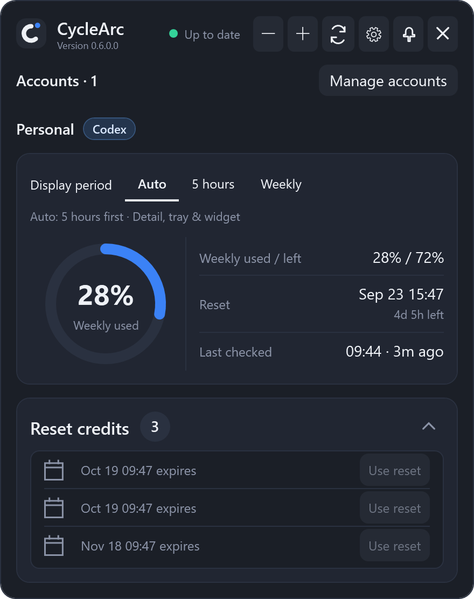</td>
    <td>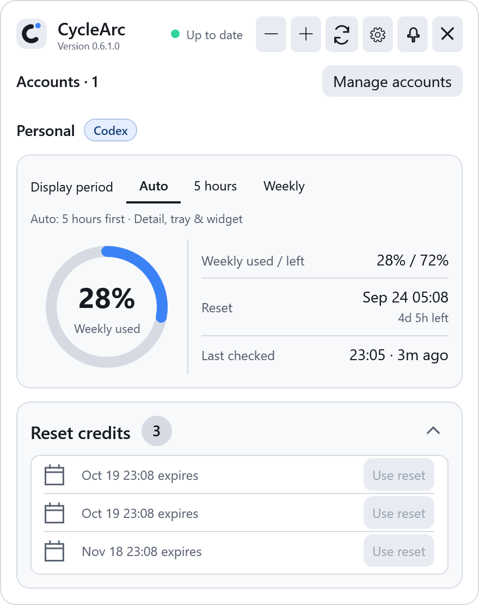</td>
  </tr>
</table>

*English previews rendered from the production WPF views using sample quota data. Available windows and reset-credit details depend on what your account reports.*

## Cursor connection

1. Sign in to the intended account in the Windows Cursor app.
2. Open **Manage accounts → Add an account → Connect Cursor** in CycleArc. No token copying is needed.
3. Manual refresh and the configured automatic interval query usage. The popup shows each allowance separately, its reported reset and the last successful check; the widget offers a compact summary with those details on hover.

**Cursor Models · Monthly**, **Other Models · Monthly** and **Grok Bot · Weekly** use the official names in both languages. Account cards, popup, tray and widget show the allowance and its cadence; the large ring names the allowance whose usage percentage it represents. Reported on-demand budgets remain separate. Missing limits and reset times stay unknown; legacy dollar accounting is never added to model percentages. Failed checks keep the last good values and success time visibly stale. A changed Cursor login hides the previous account's quota; sign back in to the original Cursor account to reconnect that profile.

The Cursor widget prioritizes **Cursor Models**, **Other Models**, then **Grok Bot**, showing at most three reported allowances under Monthly / Weekly headings. Inside the ring, **Cursor**, **Other** or **Grok Bot** identifies the allowance above its used percentage; the adjacent rows and tooltip retain the full name. The ring prefers a known value in that same order, regardless of response order. Disabled on-demand and other budget rows stay in the tooltip and detail popup, along with exact reset and update times. Healthy server data has no bottom status row; unknown values, stale data and authentication errors remain explicit.

If only Grok Bot is unavailable, the monthly allowances remain updated and continue refreshing. Grok Bot's retry delay applies only to Grok Bot; its unverified value is omitted, with an explanation in the popup. Account mismatch still respects the configured automatic interval, including after reopening the popup or restarting CycleArc.

CycleArc reads only the required access-token key in Cursor's local account database and uses it in memory for first-party queries. It never persists, logs or renews the token or modifies Cursor settings. Disconnect affects CycleArc only. The standard Windows user-data location is supported; custom `--user-data-dir` locations are not searched. These observed internal interfaces may change. See [Windows verification and quota semantics](docs/CURSOR.md).

| Cursor popup | Cursor widget |
| --- | --- |
| 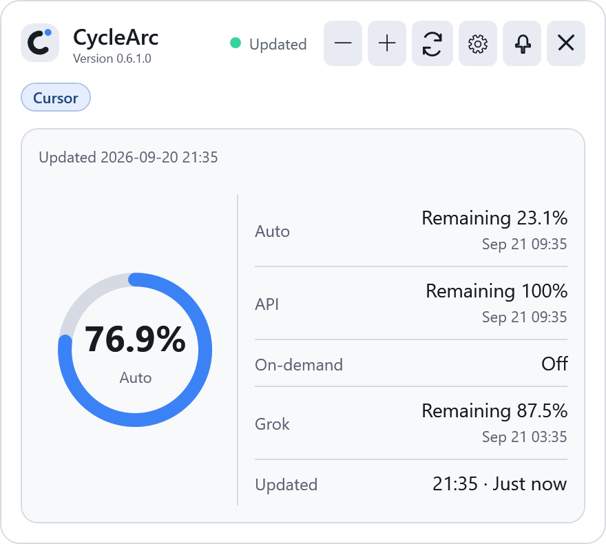 | 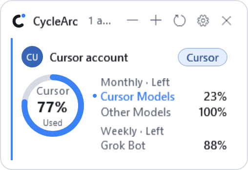 |

Production views with synthetic usage values; these images do not show a real account.

## At a glance

- **Codex, Claude and Cursor together.** Connect an existing CLI login or sign in through the official browser flow. Connected Claude accounts appear immediately, with **Awaiting usage** until the first sample. Select an account for the detail card and tray; the widget compares accounts side by side and highlights the selection.
- **Usage in the tray.** A Windows notification-area icon keeps the meter within reach. Click for the detailed card; pin it to keep it visible.
- **Clear quota windows.** See usage and remaining percentages, reset times and countdowns for each reported five-hour or weekly window. The ring, tray and widget share one display period: **Auto** uses a known five-hour percentage first, then weekly. Choose **Auto / 5 hours / Weekly** above the detail ring, or click the ring to switch when both values are known. The selection applies immediately to all three views and is saved across restarts. If the selected period has no known value, a known available period is shown with an explanation in the detail card.
- **Reset credits.** View the available count and expiry times when the server supplies them. Use an individual reset after confirmation. Missing expiry information stays explicitly unknown.
- **Optional desktop widget.** A compact, draggable summary that compares every displayable Codex, Claude and Cursor account side by side: one fixed-width module each, with aligned account names and usage rings. Codex and Claude show the remaining amount and reset countdown for every reported period; Cursor uses the three-allowance summary described above. Accounts keep their managed order and are never combined. One row holds as many modules as the widget's own monitor allows and the rest wrap to the next row; a list taller than the work area scrolls inside it. Opacity, always-on-top and click-through are unchanged. Click a module to select that account and open the usage popup; clicking the header or an empty part of the widget only gives it the keyboard, without opening the popup. The thin header carries its own size controls, refresh, settings and a hide button. Off-screen positions recover automatically.
- **Your preferred appearance.** Dark, Light, or live System theme; English and Korean; keyboard zoom from 80% to 150% for the detail card and the widget, each kept separately.
- **Honest refresh states.** Codex refreshes on its selectable 1, 2, 5, 10, 30 or 60-minute interval (default: five minutes). Claude actively checks the shared quota through the connected Desktop login during manual and configured scheduled refresh. Successful live data is **Updated** with a last-checked time; statusLine and Desktop history fallbacks are **Received** with source time. Failed checks keep previous values visibly stale.

## Get started

**Requirements:** Windows 10/11 on x64. Codex monitoring requires the installed Codex CLI and network access; discover an existing CLI login or sign in to another account through CycleArc. Claude monitoring requires the official Claude CLI for connection verification, Windows PowerShell, a signed-in Claude Desktop account for live checks, and a signed-in Claude Pro or Max account. StatusLine and Desktop subscription history remain fallbacks.

1. Download **`CycleArc-Setup.exe`** from the [latest release](https://github.com/frozenvoice/cyclearc/releases/latest).
2. Run the setup program, review the installation location and choose **Install**. Follow its progress, then choose **Run CycleArc → Finish**. A new installation goes under `%LOCALAPPDATA%\Programs\CycleArc`; an existing installation keeps its registered location, including the former `%LOCALAPPDATA%\CycleArc` path. The .NET runtime is bundled. Your settings, accounts and quota cache remain under `%LOCALAPPDATA%\ProMeter`.
3. Open the tray icon and **Manage accounts → Add an account**. For Codex, existing CLI sign-ins are discovered automatically; choose **New account sign-in** to add another account. For Claude, choose **Connect Claude**, then connect the current login or sign in through your browser.
4. Codex appears after a successful quota check; Claude appears after verified connection and attempts a Desktop live check, with statusLine/history fallback when needed. If Codex cannot be found, install the [Codex CLI](https://developers.openai.com/codex/cli/) or open **Settings → Connection** and select its executable path. For Claude setup, follow the [connection steps below](#claude-code-connection).

CycleArc discovers `codex.exe` or `codex.cmd` through PATH and supported installation locations. The Codex CLI itself is not bundled. Sign-in remains managed by Codex.

### Running and updating versions

An ordinary launch keeps the first running instance and opens its popup, which shows the running version. Development builds and releases have equal priority. Windows startup uses the installed launcher and does not bring an already running window forward.

The setup installs the stable channel and keeps it current through GitHub Releases. CycleArc checks 20 seconds after startup and then every six hours. A stable release is offered with English/Korean release notes; choose **Download update**, then **Restart & update** to apply it, or choose **Later**. Updates are not applied automatically at startup. The complete `.nupkg` is SHA-256 checked after download and again before Velopack applies it.

Release artifacts are unsigned unless the release pipeline is configured for code signing. Installing with `CycleArc-Setup.exe` alone does not remove Windows SmartScreen warnings.

Before replacement, CycleArc keeps a verified copy of the previous app outside its installation. If replacement fails or the new desktop does not become ready, a separate helper restores and restarts the previous version. Accounts and settings stay outside both app versions. If recovery itself is blocked, the backup is retained and its location is shown; this check covers startup, not failures later in a session.

The installed desktop runs from `current\CycleArc.exe` under its managed installation root. For a new install that is `%LOCALAPPDATA%\Programs\CycleArc\current\CycleArc.exe`; an existing install can remain at `%LOCALAPPDATA%\CycleArc\current\CycleArc.exe` or another registered `InstallLocation`. The root `CycleArc.exe` is the stable launcher used for desktop and Windows-startup entry points; Claude statusLine and failure callbacks use the current executable directly so stdin/stdout forwarding remains synchronous. Existing exact CycleArc-owned Claude callbacks migrate after a matching CLI identity check, including when their old executable has already been removed. Unrelated settings, the previous statusLine command, account bindings and nicknames remain intact.

The first setup launch can close an older canonical legacy desktop after verifying its current-session IPC identity. A development build running from another path keeps the normal first-instance policy. The former `%LOCALAPPDATA%\CycleArc` installation is retained when it already exists, while development builds use `%LOCALAPPDATA%\Programs\CycleArc-dev` and are not updated by the GitHub release checker.

Removing CycleArc through **Settings → Apps** (or `Update.exe --uninstall`) restores the Claude settings this installation changed before its files are deleted. Only callbacks that belong to the installation being removed are touched: the previous statusLine comes back exactly as it was, the CycleArc failure hook is removed, and a statusLine you replaced yourself, another tool's hooks and any wrapper belonging to a different CycleArc installation stay as they are. Accounts, preferences, quota history and Claude connection records under `%LOCALAPPDATA%\ProMeter` are never deleted or signed out, so reinstalling finds them again. The cleanup is time-boxed and cannot delay removal; when settings are locked, damaged or edited at the same moment, the file is left untouched and the outcome is recorded in `%LOCALAPPDATA%\ProMeter\claude-uninstall-cleanup.json`.

<details>
<summary><strong>Update preview</strong></summary>

<p>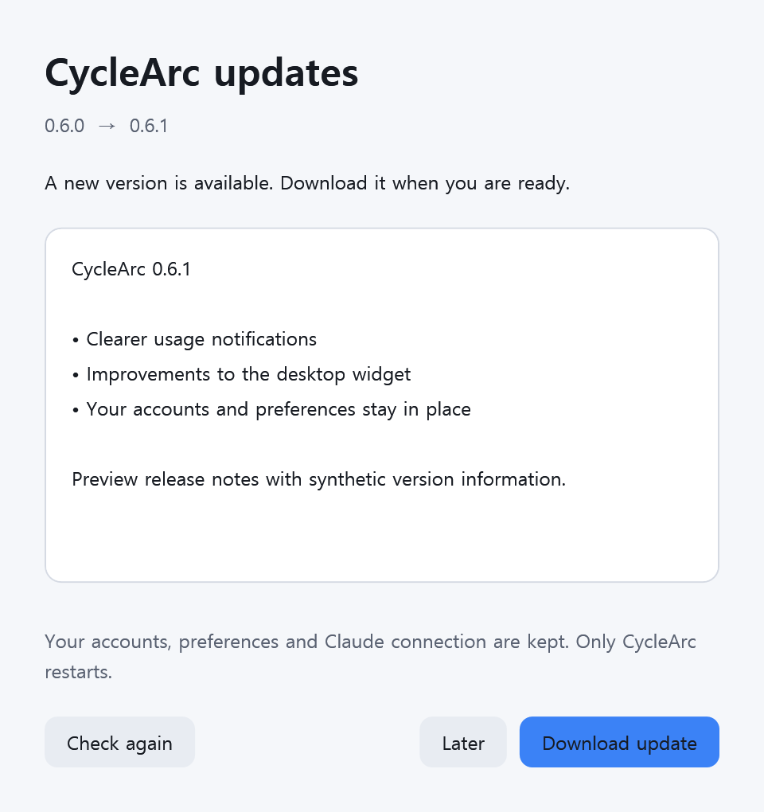</p>
<p>Production WPF view showing a sample 0.6.0 → 0.6.1 upgrade with release highlights for the multi-account widget, independent popup/widget sizing, and install progress. Downloading does not restart the app; a separate Restart &amp; update action appears after verification.</p>

</details>

### Accounts

**Manage accounts** is available in the popup and **Settings → Connection → Manage Codex and Claude accounts**. **Add an account** offers Codex login/discovery and Claude connection. It opens automatically when there is no previously checked account; existing users see their account list first. Accounts retain separate percentages, reset windows and refresh states; values are never added together. Reset credits belong only to the selected Codex account.

**Codex profiles keep their verified login.** Profiles marked **Login changed** or **Check connection** stay visible with quota and reset credits hidden. If the affected profile is selected, the detail card, tray and widget retain that selection. Follow [Codex connection recovery](#codex-connection-recovery) to restore it.

**Connected Claude accounts remain visible while awaiting usage.** They show **Awaiting usage** and unknown limits, without increasing the attention count. Unconnected profiles stay in **Manage accounts** and do not increase the main account count. Previously received values remain visible as stale during a temporary update failure. Popup and tray show the selected account; the widget lists every visible account and marks the selected one. If none is available, the widget stays hidden and the popup shows a connection hint.

<table>
  <tr>
    <td align="center"><strong>Two ready accounts · Dark</strong></td>
    <td align="center"><strong>Two ready accounts · Light</strong></td>
  </tr>
  <tr>
    <td>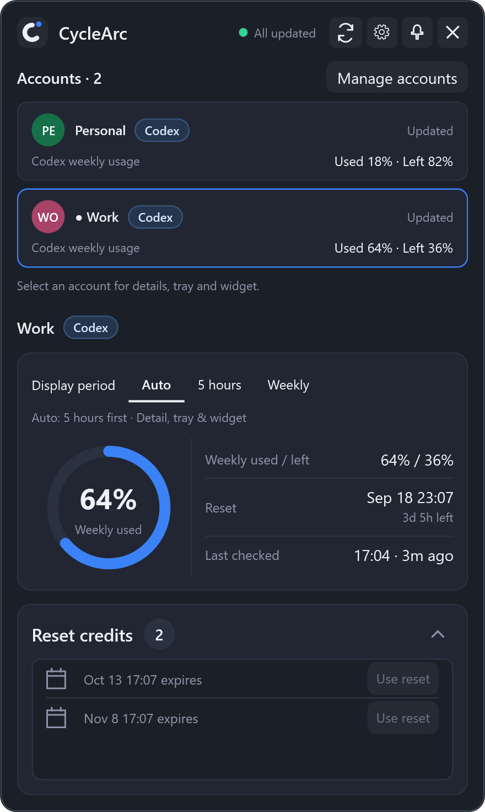</td>
    <td>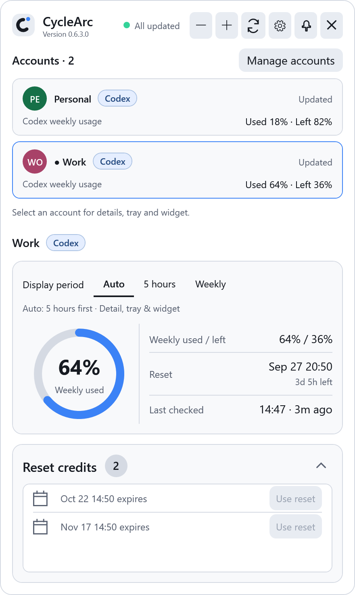</td>
  </tr>
</table>

*These are production UI renders with entirely fictional accounts and quota data, not captures of a user's account. Names, `example.invalid` email addresses, percentages, reset times and credits are samples.*

Read the example from the account list down to the detail card:

1. **Compare accounts separately.** Personal has used 18% and Work 64% of their own Codex weekly windows. These percentages are not combined into one allowance.
2. **Choose the detail account.** The blue border and dot mark Work as selected, so the ring shows Work's **64% used**, with **36% left** in the quota row. The reset-credit card also belongs to Work. Clicking another account changes the detail card, tray and widget; it does not switch the login used by your other Codex apps or start a refresh.
3. **Keep unconnected profiles out of the overview.** The previously registered Research Claude profile has not been connected. It remains in account management, but the main view shows **2 accounts** and **All updated**. Connecting it makes it visible immediately; see the [Claude example](#claude-code-connection).

To connect an account, choose the option that matches your setup:

| Your situation | Choose | What happens |
| --- | --- | --- |
| First Codex use, or adding another Codex account | **Add an account → New account sign-in** | Complete the official browser login for that account; CycleArc checks its usage and keeps its Codex home separate. |
| Already signed into Codex CLI on this PC | **Find accounts on this PC** | Connect the existing login from a known Codex home. A ChatGPT website-only login is not enough. |
| Already use a custom `CODEX_HOME` | **Advanced · Connect a specific Codex folder → Choose Codex home folder** | Select that home folder, not the Codex executable or a project folder. |
| Already signed into Claude Code | **Add an account → Connect Claude → Connect current login** | Verify the current official CLI login and configure usage updates automatically. |
| Adding a separate Claude login | **Add an account → Connect Claude → Sign in to Claude** | Complete official browser login in a separate Claude configuration. When already signed in, this button reads **Sign in to another account**. |

Set a **Nickname in CycleArc** to recognize an account; leaving it empty shows the reported email, or a provider/profile label when email is unavailable. Codex supplies email/plan through its account API; Claude supplies login metadata through its official CLI. Circular icons are generated locally from the displayed name and a stable account color. They are not synced web avatars; saving a nickname does not change the provider profile. The widget shows this name even when only one account is connected. Expand **Nicknames, icons and account actions** for details.

Use **Order ↑ / ↓** beside each account's nickname to move it. The popup follows the same order among visible accounts, which is saved immediately and retained after restart. Reordering keeps the selected tray/widget account and does not initiate a quota refresh. Select a card with usage to change which account drives the tray/widget. **Reconnect** gives a linked Codex profile an independent login; **Sign in again** renews or changes a Codex login already managed by CycleArc. **Connect** opens a Claude profile's connection window. **Remove** forgets the profile from this list.

<details>
<summary><strong>Account manager · Dark preview</strong></summary>

<p>The account manager retains all three profiles, including the unconnected Research profile. Its summary cannot be selected yet, while Connect, nickname and order actions remain available. The main popup above counts only the two ready accounts. Work stays selected while you arrange the list.</p>
<p>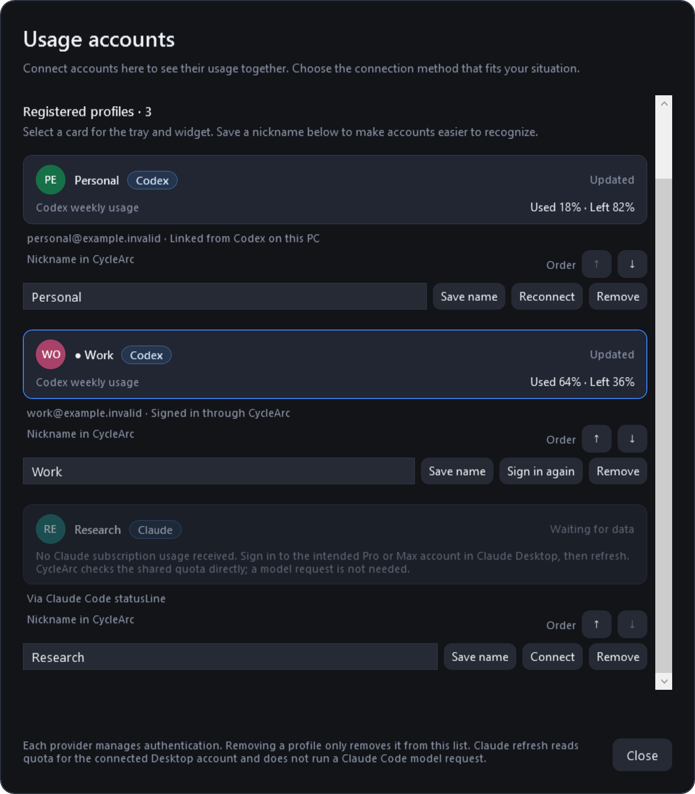</p>

</details>

<details>
<summary><strong>Account manager · Light preview</strong></summary>

<p>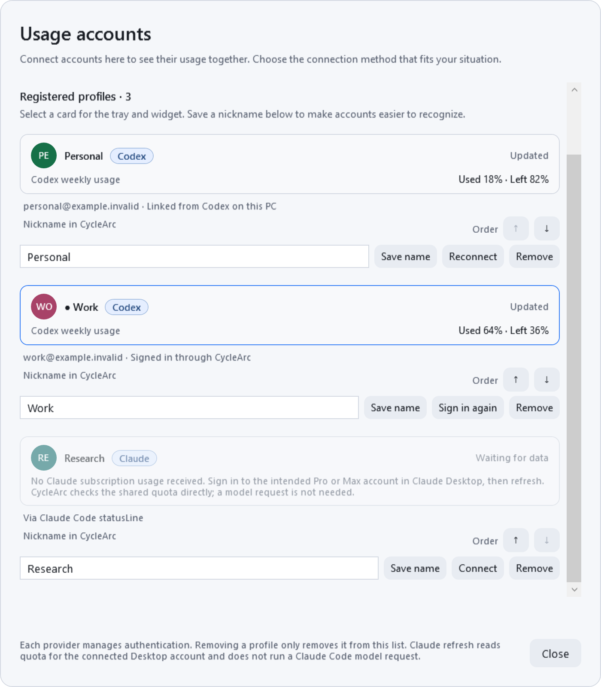</p>

</details>

**Find accounts on this PC** checks `CODEX_HOME` from the process/user/machine environment and the default `~/.codex` directory through `account/read`. It cannot discover an account signed in only on the ChatGPT website. **Advanced · Connect a specific Codex folder → Choose Codex home folder** connects another known home; choose the home, not the executable or a project folder. It does not search the disk for credentials or copy an existing login. Imported homes stay linked to their original Codex installation until **Reconnect** creates an independent login for that CycleArc profile.

New and reconnected Codex profiles receive separate homes under `%LOCALAPPDATA%\ProMeter\accounts\<local-id>\codex-home`. Only the installed Codex process stores and renews credentials there. One browser login can run alongside usage checks for other accounts.

Removing a profile forgets its reference without logging out or deleting its Codex home. It will not be automatically re-added. A custom home can be connected again with the folder picker.

The first launch opens the detail card. Later launches start in the tray; `CycleArc.exe --show` opens the card at startup. If Windows hides the tray icon, move it out of the notification-area overflow. Starting with Windows and showing the desktop widget are optional settings.

#### Codex connection recovery

Nicknames are local display names. **Same reported login email as another profile** means that the profiles report the same login email; the official protocol cannot distinguish workspaces sharing that email. When a profile linked from an existing Codex home matches a profile signed in separately through CycleArc, the linked profile instead shows **Check connection** and hides its quota and reset credits. That conflict remains until reconnection, including after restart or removal of the matching profile. **Check connection** also appears when the saved account binding cannot be verified.

1. Open **Manage accounts** and find the affected Codex profile. Choose **Reconnect** for a linked profile, or **Sign in again** for a login managed by CycleArc.
2. Complete the official browser login with the intended account.
3. **Reconnect** verifies login and usage before replacing the old link. It preserves the nickname, list position and selection. Cancelling, choosing an already connected account or failing the usage check keeps the existing link.

Browser sign-in has a five-minute deadline and can be cancelled. If it times out and the browser later cannot connect to the localhost callback, start sign-in again from the same profile button to open a new session.

### Claude Code connection

**Claude subscription usage is shared across Web, Desktop and Code.** CycleArc actively checks the shared quota during manual refresh and the configured automatic interval through the connected Claude Desktop login. A successful server check is labeled **Updated** with its last checked time. Claude Code statusLine and Claude Desktop's local subscription usage history remain fallback receipts, labeled **Received** with their source time; Web/Desktop activity also consumes the same allowance. [Official usage-limit explanation](https://support.claude.com/en/articles/11647753-how-do-usage-and-length-limits-work).

To check current usage independently, choose **Open usage page** on the Claude detail card or connection window. It opens [Claude Settings → Usage](https://claude.ai/settings/usage) in your browser; check that the intended account is signed in. Opening the page does not refresh CycleArc. Public API, CLI and SDK documentation still provide no supported stable personal-subscription quota query. CycleArc uses a narrow private first-party Desktop profile/usage path for its live check; it may change without notice. See the [dated research and decision](docs/CLAUDE-USAGE-RESEARCH.md).

1. Open **Manage accounts → Add an account → Connect Claude**. Set an optional nickname.
2. Choose **Connect current login** to verify the existing Claude CLI login, or **Sign in to Claude** to complete the official browser flow. CLI verification establishes the CycleArc connection; live quota requests use the connected Claude Desktop login. Other settings and the existing status line are preserved; no JSON copying is required.
3. Sign in to the **same account in Claude Desktop**, then choose **Refresh** in CycleArc. Manual and automatic refresh query the shared quota directly, without a model request. The interval in **Settings → Connection** applies to both Codex and Claude (default: five minutes).

Claude Code statusLine and Desktop subscription history also provide local fallback samples. CycleArc preserves their observation times; rereading a file does not count as a successful server check. Desktop history may be delayed and has no reset timestamps.

If authentication fails, the profile shows **Claude Desktop login required** and keeps the last valid values marked as stale. If the Desktop identity does not match the connected account, CycleArc hides all Claude quota for that profile. Sign in to the intended account in Desktop, then refresh. Rate-limit and request failures also retain previous values and show the reason the check failed.

A Claude plan change keeps the same account when its email and organization match. After sign-in recovery, callbacks from an older connection generation cannot change the latest sample or its receipt time. Older saved bindings are upgraded only after their identity is verified; see [connection compatibility](docs/CLAUDE.md#account-identity-compatibility).

**CycleArc actively checks the shared quota through the connected Claude Desktop login.** StatusLine and Claude Desktop history remain fallback receipts. A connected account can show **Awaiting usage** until the live or fallback source returns a valid sample. When live data succeeds it is labeled **Updated** with its server-fetched time; fallback data is **Received** with its source time. When sources are available together, the newer observation wins. Repeating **Connect current login** reuses the same verified binding and preserves its name and usage history. Closing or cancelling a new connection before it succeeds removes its empty draft.

<details>
<summary><strong>Connected, awaiting usage · Dark and Light</strong></summary>

<p>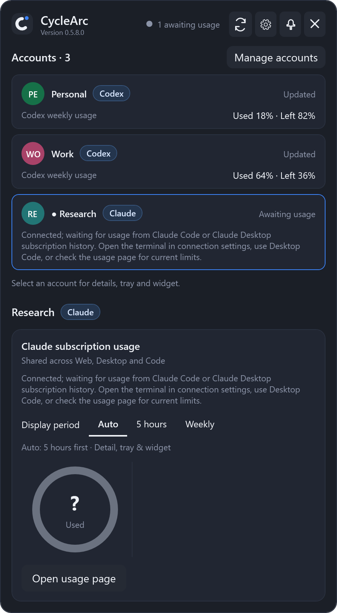 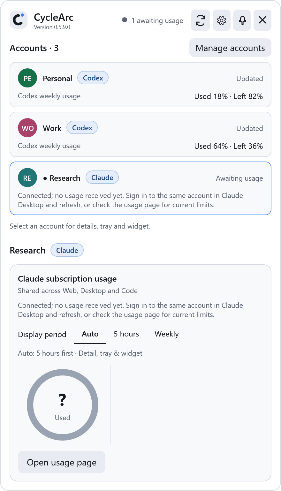</p>

</details>

<table>
  <tr><td align="center"><strong>Automatic connection · Dark</strong></td><td align="center"><strong>Automatic connection · Light</strong></td></tr>
  <tr>
    <td>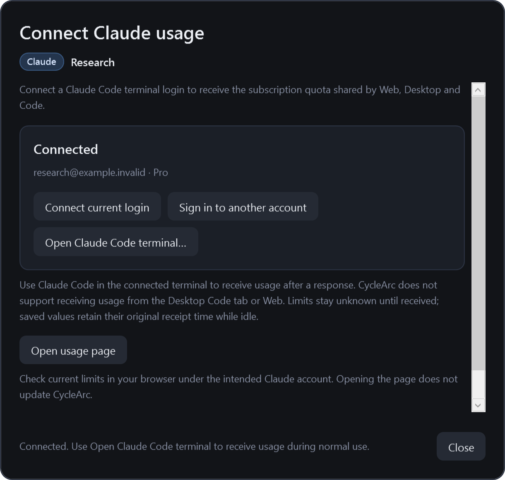</td>
    <td>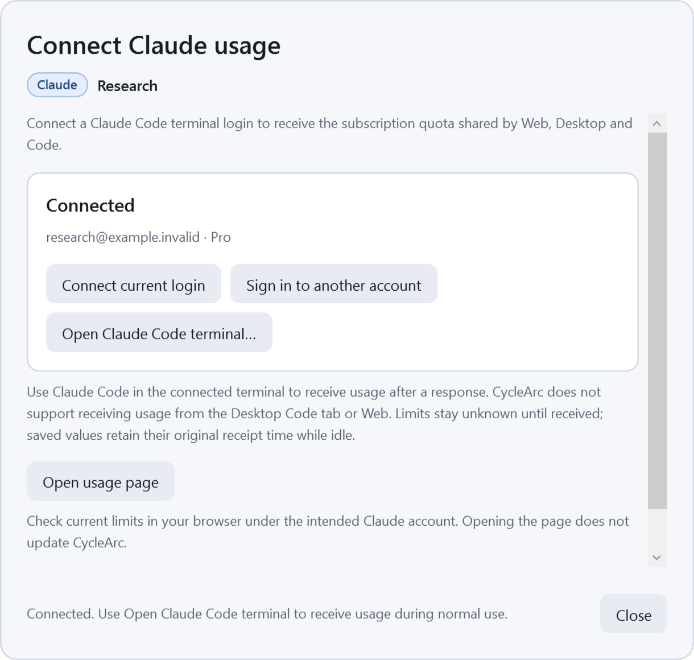</td>
  </tr>
</table>

*Research is selected below, alongside two Codex accounts. Synthetic server data (46% five-hour, 11% weekly, with reset times) shows the **Updated** state. These previews do not access a real login.*

<table>
  <tr><td align="center"><strong>Desktop live quota · Dark</strong></td><td align="center"><strong>Desktop live quota · Light</strong></td></tr>
  <tr>
    <td>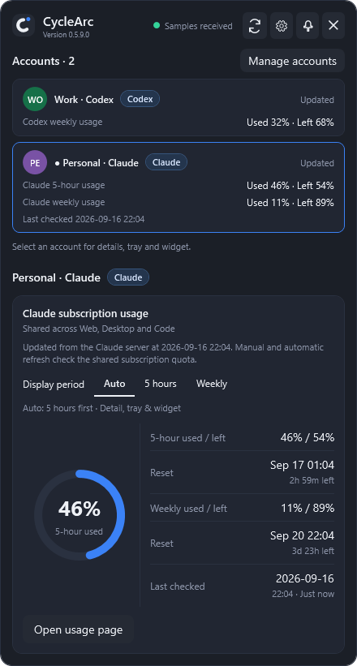</td>
    <td>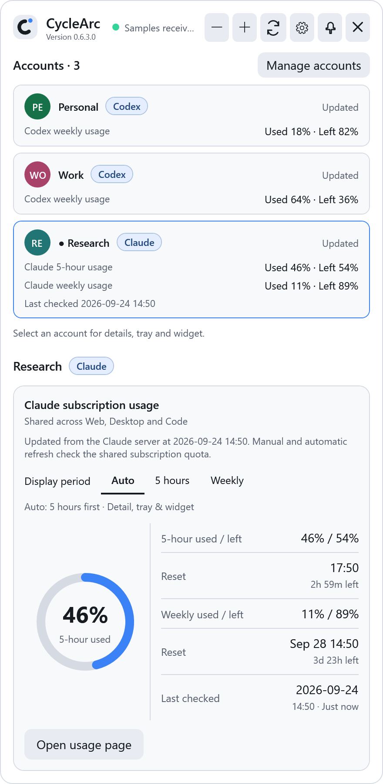</td>
  </tr>
</table>

The official statusLine JSON has **no account email or account ID**. Desktop history carries an organization ID, not an email. The live Desktop reader reads only the app-owned config.json and Local State, decrypts the protected OAuth access token in memory with Windows DPAPI/AES-GCM, verifies the profile response email and organization against the bound identity, then requests usage. It never writes or refreshes Desktop credentials, reads cookies, or stores the token. A mismatched identity hides all Claude quota for that profile and cannot replace the last-good projection. Email stays in memory for display; a nickname takes precedence.

A successful live response is **Updated** and shows its server-fetched time. StatusLine and Desktop history fallbacks stay **Received** with their original source time. Authentication, rate-limit and ordinary request failures preserve the last-good values as **stale**. A Desktop profile identity mismatch hides all Claude quota for that profile and never replaces the last-good projection. Manual and scheduled refreshes attempt the live check, while the two-second passive loop reads only local sources. No reset is inferred when a source omits it, and percentages never roll back to zero locally. Claude has no Codex reset-credit controls.

<details>
<summary><strong>Claude Desktop history fallback · Dark and Light</strong></summary>

<p>This separate preview shows a Claude Desktop history sample: 91% five-hour and 47% weekly usage, with unknown reset times. It is labeled <strong>Received</strong> with its original observation time. A server-check failure additionally marks retained values as stale. The two Codex accounts still show current data.</p>
<table>
  <tr>
    <td>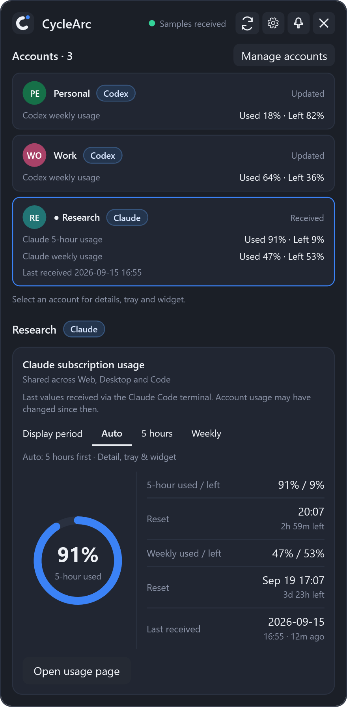</td>
    <td>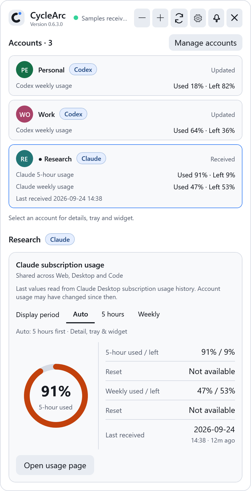</td>
  </tr>
</table>

</details>

**Connection details → Disconnect** first saves the disconnected state, then restores the previous status line and removes CycleArc's own failure hook. The profile stays hidden from the main view across restarts while its last-good cache and configuration remain in account management. Reconnecting shows **Awaiting usage** until a live or fallback source succeeds; it does not log out of Claude.

If setup reports that the statusLine command is too long, move the existing inline statusLine into a script file and use a short command to call it, then connect again. The limit applies to the full generated command, including paths and encoded options; failed setup preserves the existing settings.

Usage comes from the Desktop live profile/usage check when available, then the official statusLine input or Claude Desktop app-owned history fallback. The live reader reads only config.json and Local State, decrypts the OAuth access token in memory with Windows DPAPI/AES-GCM, verifies the bound profile, requests quota and discards the token. It never writes or refreshes Desktop credentials, reads cookies, launches a model turn, inspects transcripts or stores raw history. The private endpoint is an internal compatibility dependency and is not claimed as an official public API. It saves projected quota fields, source/receipt/status metadata and local connection paths/fingerprint.

### Controls

| Action | Result |
| --- | --- |
| Click the tray icon | Open or hide the detail card |
| Refresh button | Check account limits immediately |
| Auto / 5 hours / Weekly | Choose the period shared by the detail ring, tray and widget; saved across restarts |
| Click the usage ring | Switch between five-hour and weekly usage when both values are known |
| Pin button | Keep the detail card on top |
| `Ctrl` + `+` / `Ctrl` + `-` | Enlarge or reduce the focused window - the detail card or the widget |
| `Ctrl` + `0` | Restore the focused window to 100% |
| `-` / `+` in either header | The same step as the shortcut, for that window only |
| Drag the widget | Move it and save its position; a finished drag never opens the popup |
| Click a widget account | Select that account everywhere and open the usage popup |
| Click the widget header or empty area | Give the widget the keyboard, without opening the popup |
| Widget header buttons | Resize the widget, refresh, open Settings, or hide it without exiting CycleArc |
| Right-click the widget | Open its menu, including Close widget |

The zoom shortcuts also support the numeric keypad. The detail card and the widget keep their own size: a shortcut or button changes only the window it was aimed at, and both sizes are saved across restarts. The tray menu resets either one: **Reset size (100%)** for the detail card, **Reset widget size (100%)** for the widget. Widget position can be reset from **Settings → Widget**; saving moves it to the primary screen and recreates its window so a missing widget can recover even when Windows reports it as visible.

With **Show widget** enabled and a displayable account, CycleArc checks the native window every two seconds and restores unexpected hiding, minimization or displacement behind ordinary windows despite an enabled always-on-top setting, without taking keyboard focus. After sleep, unlock or display changes it recreates the widget with the saved position, opacity and interaction settings. Turning the widget off still keeps it hidden. Recovery events are recorded in the local app log.

The **Usage number** tray style shows bold digits as large as the native icon slot allows, keeping their original font proportions on a transparent background. The **%** sign is omitted: **67** means **67% used**. Text is white on a dark Windows taskbar and dark on a light taskbar, independently of the app theme. The number is the selected account's percentage used for the period chosen in the detail card. **Auto** prefers a known five-hour value, then weekly. The tooltip identifies the period being shown; switching periods only changes the display of the received data. Unknown usage is **?**. Check the tooltip or detail card for status and receipt time. The optional **Usage ring** retains its status colors: blue for a valid sample, red for a valid sample at 100%, and amber for stale data or a lookup/connection problem. Without a known value, the ring is gray with **?**.

All three providers use whole-percent text in the widget and up to two decimal places in the detail popup, including its ring, account summaries and quota rows. Widget rounding uses the original value: **76.91% → 77%**, while **76.499% → 76%**. For a complementary used/remaining pair, the remaining display complements the rounded usage: **76.5% / 23.5% → 77% / 23%**. Nonzero values below 1% show **<1%**, and values above 99% but below 100% show **>99%**; exact 0% and 100% stay exact. Detail values omit trailing zeros (**97.1%**, **77%**) and preserve tiny values as **<0.01%** or **>99.99%**. Unknown or invalid percentages stay **?**. Monetary amounts, unlimited/off labels, precise widget tooltips, original values, ring arcs and warning colors keep their existing meaning. Tray digits, tooltips and rings keep their existing policy, including Cursor's **76.91% → 77** tray digits.

The widget collapses the entire bottom **Updated** row and its spacing for successful Claude and Cursor server samples. Exact check times and source information remain in the account tooltip and detail popup. Claude Desktop history and Code statusLine samples keep **Received**; stale data, failed checks, sign-in/account changes and initial waiting states keep their status row. A new failure restores the row, and a subsequent successful server check collapses it again without changing the quota rows, ring alignment or widget width.

<details>
<summary><strong>Settings and compact widget</strong></summary>

<p>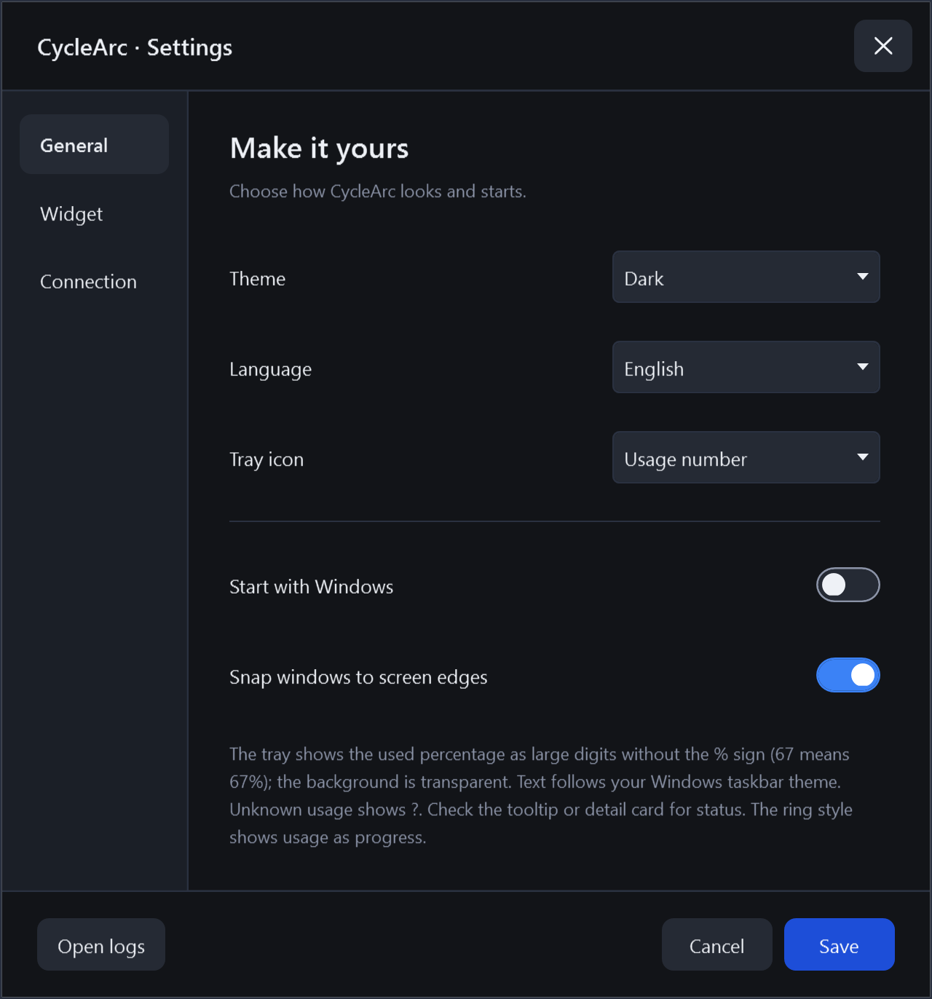</p>
<p>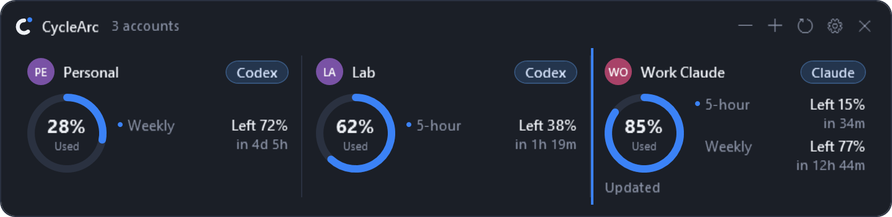</p>

</details>

## How it works

CycleArc starts a bounded, short-lived **Codex App Server** process per account and requests account/rate-limit metadata. Every UI entry point shares the same refresh batch, with at most two simultaneous reads. One interactive login may run alongside reads for other accounts. It does not run a model turn to measure usage.

Percentages come from the reported limit windows. CycleArc does not turn them into invented request counts or combine unrelated reset periods. A successful Claude Desktop live check is labeled **Updated** with its fetched time; statusLine and Desktop history fallback values are **Received** with source time. A temporary failure leaves last-good values visible as stale. Claude manual and scheduled refreshes use the active Desktop check; the two-second passive loop reads only local projections. The newer fallback observation is displayed when live data is unavailable.

Countdowns and “last checked” ages update locally once a minute without another server request.

### Privacy

- No prompt, response, conversation, project, or rollout collection.
- Claude live refresh reads only the app-owned Desktop config.json and Local State needed to obtain its protected OAuth token; DPAPI/AES-GCM decryption is memory-only. It never writes or refreshes Desktop credentials, reads cookies, or persists the token. StatusLine and Desktop history are projected fallbacks.
- No external telemetry or analytics.
- Only local preferences, profile references/labels, projected quota metadata, source/receipt metadata, connection paths/identity fingerprints and safe diagnostic logs are retained. Reported emails stay in memory for display. The Desktop token is discarded after the read; raw history, credentials, cookies, prompts, responses and transcripts are never copied into CycleArc.

Settings and quota cache remain under `%LOCALAPPDATA%\ProMeter` for upgrade compatibility. Settings use atomic replacement with a previous-good backup and recovery if the primary file is damaged.
The account registry (`codex-accounts.json`) also uses atomic writes and a previous-good backup. The legacy default profile uses `codex-snapshot.json`; new profiles and profiles replaced through **Reconnect** have separate quota caches. Reconnection preserves the old home and cache. Existing preferences and historical files are preserved.

CycleArc is an independent project and is not affiliated with or endorsed by OpenAI or Anthropic. Compatibility depends on the installed Codex App Server, Claude CLI/statusLine protocol, Desktop OAuth/history formats, first-party quota responses and the metadata available to your account.

## Build from source

Requires Windows, PowerShell 7, and the .NET 8 SDK. Building `CycleArc-Setup.exe` from source also requires Visual Studio Build Tools 2022 with the **Desktop development with C++** workload (including the MSVC x64/x86 tools and Windows SDK) because the setup window is Native AOT. Running a shipped installer does not require Visual Studio or these development tools, and `build-local` reuses an existing Visual Studio installation when it already provides suitable components.

When `build-local.cmd` or `scripts/Build-Local.ps1` runs interactively and the prerequisite check fails, it explains what is missing and offers only **Install required Microsoft build tools**, **Show manual installation instructions**, or **Cancel**. Installation requires explicit approval, uses the official Microsoft bootstrapper, and runs only after its Authenticode signature is verified as Microsoft-signed. Company-managed PCs may require administrator or IT approval. `-NoPrerequisitePrompt` opts out of this interactive prompt; `-SilentInstall`, CI, and redirected stdin never prompt or install automatically and instead report the missing prerequisites and remediation before failing.

```powershell
git clone https://github.com/frozenvoice/cyclearc.git
cd cyclearc
.\dev-run.ps1
```

Double-click **`build-local.cmd`** in the repository root to build the current checkout, package `CycleArc-Setup.exe`, install that package into the managed Velopack location (new installs use `%LOCALAPPDATA%\Programs\CycleArc`; existing installs keep their registered `InstallLocation`), and start the root `CycleArc.exe` launcher from that location. It runs `dev-run.ps1 -NoLaunch` in a separate process, then uses Setup.exe. It does not copy the development EXE to the managed install.

The running desktop is only stopped after the gate is green and this run's Setup.exe exists, and it is stopped by a verified desktop IPC request for the current user's session, never by name. A failed build therefore leaves the installed app running. On failure the window prints the stage the run actually reached from `artifacts\build-local\last-failure.txt` (`Failed at:` plus a sub-stage such as `ui-smoke-desktop-instance`, not a blanket `Stage: build`), so a failure after Setup.exe started is not reported as "the previous installation is intact", and the nonzero exit code reaches CMD. `dev-run.ps1` stdout and stderr are captured to `artifacts\build-local\dev-run.out.log` and `dev-run.err.log`; a failed gate prints a tail of those files so a UiSmoke error is visible in the same window. Successful runs print each stage's elapsed time instead of dumping those logs.

`.\dev-run.ps1` remains the development publish path. It is fail-fast: restore and **Release** compile first, then the desktop-instance process check, installer/build-local script regressions, the unit suite, remaining WPF checks, then publish, package and package verification. It then publishes the development **single-file Windows x64 `CycleArc.exe`**, without debug symbols. Development output uses `%LOCALAPPDATA%\Programs\CycleArc-dev\CycleArc.exe`; it is separate from the stable Velopack installation, whose new-install default is `%LOCALAPPDATA%\Programs\CycleArc` and whose existing location is preserved, and it is not selected by the GitHub update checker. Build staging stays in the current checkout; `-NoLaunch` does not stop or replace the installed app. Filesystem deployment can restore the previous build when replacement fails; a successful file rollback does not guarantee that a newly started app passed a health check.

Preflight reports existing desktop PIDs and executable paths. After validation, the installer stops verified CycleArc desktops in the current Windows session and checks that the single-instance lock is gone before replacing files. If a desktop is running directly from build output, preflight identifies it before cleanup; exit that instance and rerun the script.

- `-NoLaunch`: validate the staged executable without replacing the running local app.
- `-Fast`: skip the unit suite only when it has already passed for the same changes.
- CI builds and checks the development single-file executable and packages the Velopack installer assets for the stable release workflow.

The same `dev-run.ps1 -NoLaunch` gate runs locally and for both pull requests and pushes to `main`.

`scripts/Verify-BuildLocalEntryPoint.ps1 -ConfirmDisposableEnvironment` drives the real `build-local.cmd` entry point end to end with nothing injected: build A through the real `dev-run.ps1` gate and the real `CycleArc-Setup.exe`, build B installed over it with the same version number but different executable content, and a deliberately broken build to check that the cause and a nonzero exit code reach CMD while the running installation is left alone. It installs and replaces a real installation for the current Windows user, so run it only on a disposable Windows VM or throwaway user; the `Windows build-local entry point` workflow runs it on a discarded GitHub-hosted runner.

`scripts/Verify-InstalledUpdate.ps1` verifies the installed application end to end: it builds three test executables with different versions and hashes, installs the first with its real `Setup.exe`, updates to the second through the production update window, coordinator, updater and recovery supervisor, forces a build that fails to start so the supervisor restores and restarts the previous version, and finally removes the installation and checks the Claude cleanup and data preservation. It installs, updates and removes CycleArc for the current Windows user and cannot isolate the data root, uninstall registry entry, shortcuts, single-instance mutex or desktop IPC, so run it only on a disposable Windows VM or a throwaway user account, with `-ConfirmDisposableEnvironment`. Its update feed is a local directory read by a test-only build flavour; HTTPS enforcement and package verification are unchanged, and its Claude accounts are synthetic rather than a live subscription check.

For a GitHub release, first pass the local `-NoLaunch` gate on the final versioned changes, then commit and push them. After Windows push CI passes, run `pwsh -NoProfile -File ./scripts/Release.ps1 -Version 0.6.1 -NotesPath "./release-notes/0.6.1.md"` (use the version and notes file being released). `-Preflight` verifies source metadata, remote commit/CI state and the downloaded package without creating tags, drafts, uploads or public releases; it does not run the local build/test gate.

The script downloads that commit's tested executable and installer assets, checks their
versions and uploaded SHA-256 values, and publishes the draft only after verification.
Existing draft notes are preserved; a new release requires `-NotesPath "./release-notes/0.6.1.md"` (replace the notes path with your prepared file). Public assets and existing tag targets
are never overwritten. Publish does not start a new build, test or packaging run.

| Path | Purpose |
| --- | --- |
| `src/CycleArc` | Active WPF tray application |
| `src/CycleArc.Core` | Quota protocol, presentation logic, persistence, and retained legacy logic |
| `tests/CycleArc.Tests` | Unit and regression tests |
| `tests/CycleArc.UiSmoke` | Production WPF layout checks and documentation previews |

See [Architecture](docs/ARCHITECTURE.md), [Validation](docs/VALIDATION.md), and [preview generation](docs/images/README.md) for implementation and verification details.

## Upgrading from earlier releases

Run the new `CycleArc-Setup.exe`. Existing preferences and quota-cache paths remain compatible. The former ChatGPT history reconstruction, browser companion, and WebView2 features are retired; old history data is neither read nor deleted by the active app. The old browser extension can be removed through your browser's extension manager.

Retained legacy source and tests are identified in the architecture document. The companion host and retired screens are excluded from the shipped executable.

## License

[MIT](LICENSE). Contributions and reproducible bug reports are welcome. Please omit account credentials and conversation content from issues and attachments.
