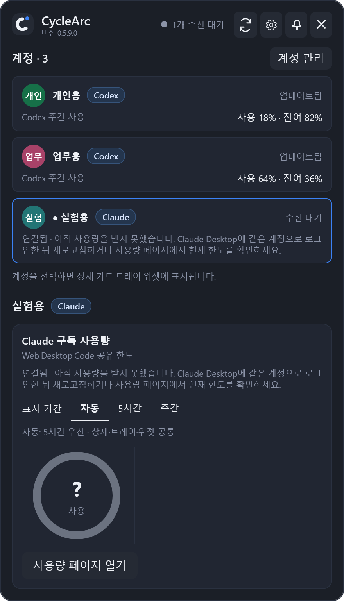
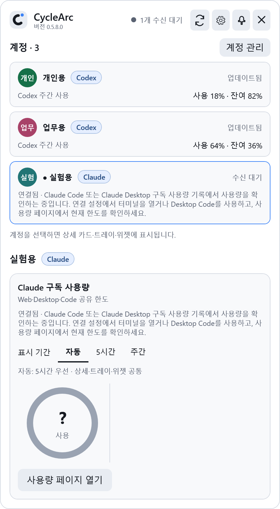
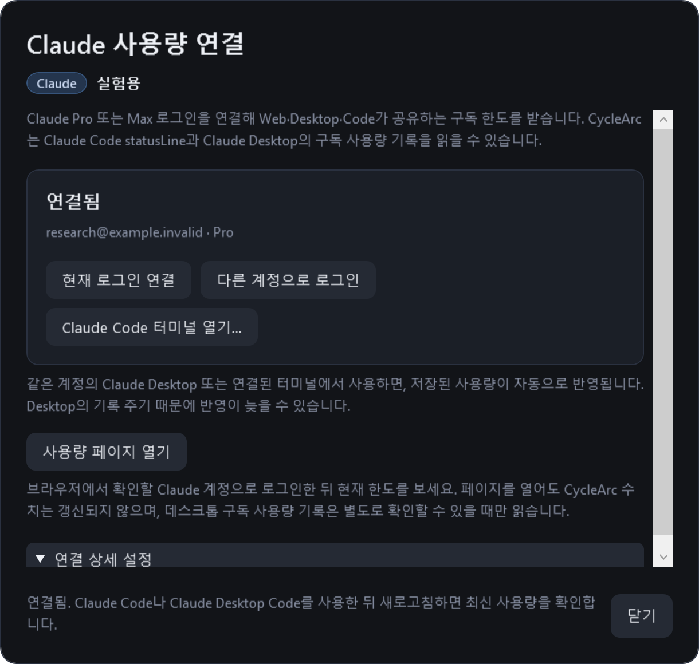
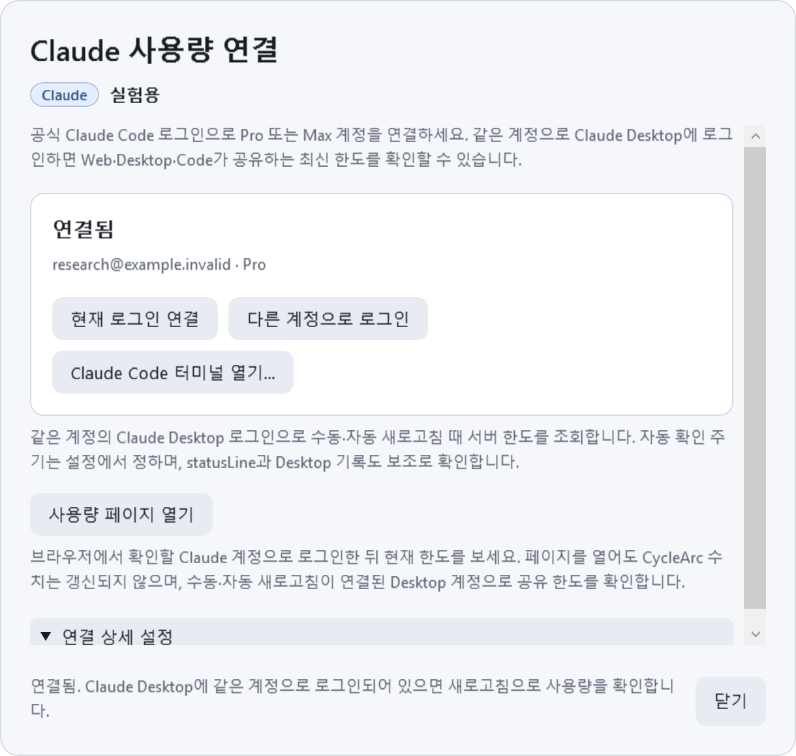
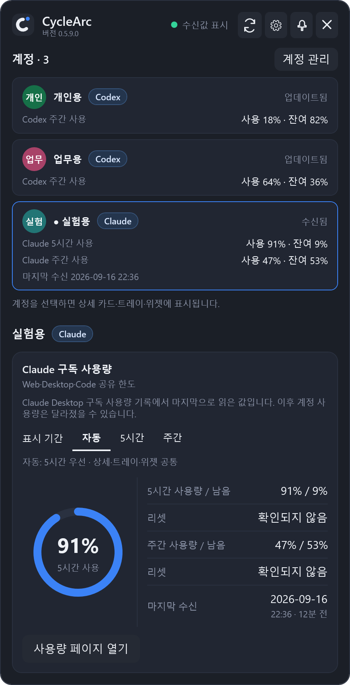
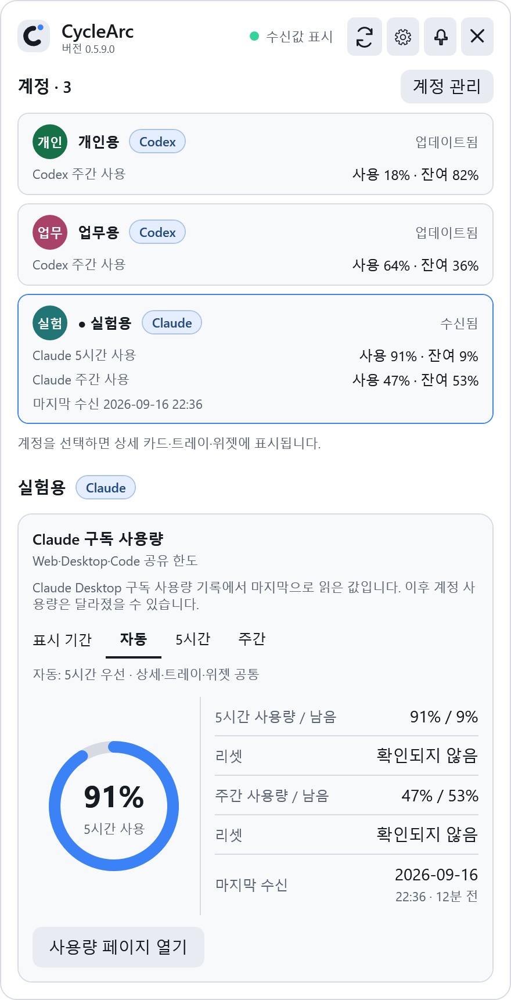
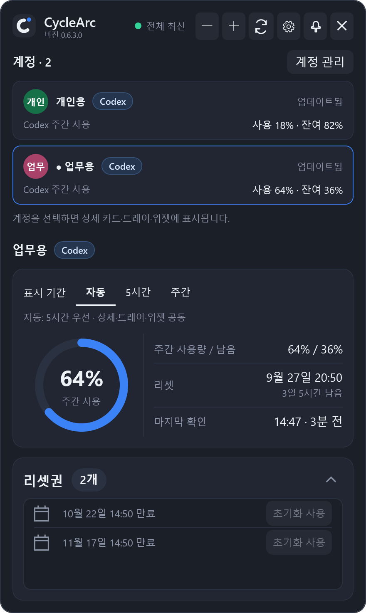
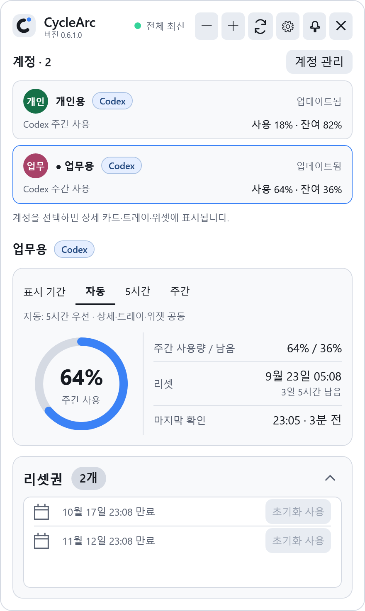
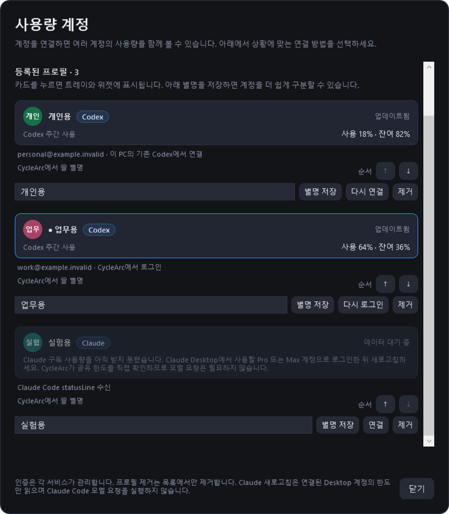
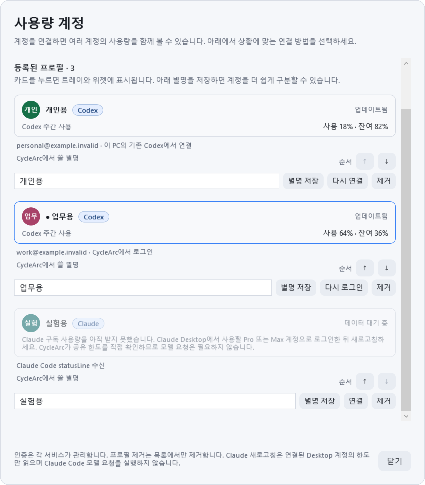

# CycleArc

[English](../README.md) · [다운로드](https://github.com/frozenvoice/cyclearc/releases/latest)

Windows 트레이에서 **여러 Codex·Claude 프로필의 사용률, 남은 비율, 리셋 시각**을 함께 확인하는 앱입니다.

계정 카드·선택한 상세 화면·트레이 툴팁·위젯의 **Codex 또는 Claude 표시**로 서비스를 구분합니다. Claude는 현재 로그인을 연결하거나 공식 브라우저 로그인을 시작하면 **CycleArc가 statusLine 연결을 자동으로 설정**합니다. Gemini는 지원하지 않습니다. 기존 Codex 계정, 설정과 캐시는 유지합니다.

> **Codex:** Plus를 포함해 공식 App Server가 보내는 5시간·주간 한도를 표시합니다. 구독 이름으로 표시를 제한하지 않으며, 없는 구간은 생략하고 알 수 없는 비율은 미확인으로 표시합니다. **Claude:** 공식 statusLine에서 한도 필드가 제공되어야 합니다. 첫 응답 전이거나 지원하지 않는 플랜에서는 필드가 없을 수 있습니다.

Codex 계정 카드에는 제공된 한도별 사용률·잔여 비율을, 상세 화면에는 리셋 시각도 함께 표시합니다. 링·트레이·위젯은 주간 비율이 있으면 주간 값을, 없으면 5시간 값을 사용합니다.

## Claude Code 연결

**Claude 구독 사용량은 Web·Desktop·Code가 공유하는 한도입니다.** CycleArc는 연결된 Claude Code 터미널을 통해 마지막으로 받은 공유 한도를 표시합니다. Web·Desktop에서 쓴 양도 같은 한도에 반영되므로 현재 계정 사용량은 수신값과 달라졌을 수 있습니다. [공식 사용 한도 안내](https://support.claude.com/en/articles/11647753-how-do-usage-and-length-limits-work).

터미널 CLI를 사용하지 않고 현재 한도를 보려면 Claude 상세 카드나 연결 창의 **사용량 페이지 열기**를 누르세요. 브라우저의 [Claude 설정 → 사용량](https://claude.ai/settings/usage)이 열립니다. 확인할 계정으로 로그인되어 있는지 확인하세요. 페이지를 열어도 CycleArc 값은 갱신되지 않습니다. 공식 API·CLI·SDK 문서 검토에서 개인 구독의 현재 공유 한도를 별도로 조회하는 지원 방법은 찾지 못했습니다. [조사 근거와 결정](CLAUDE-USAGE-RESEARCH.md).

1. **계정 관리 → 계정 추가 → Claude 연결**을 여세요. 별명은 선택 사항입니다.
2. 이미 Claude CLI에 로그인했다면 **현재 로그인 연결**을 누르세요. 새로 로그인하려면 **Claude 로그인**을 누르고 공식 브라우저에서 로그인하세요. 이미 로그인한 상태에서는 **다른 계정으로 로그인**으로 표시됩니다. CycleArc가 공식 로그인 상태를 확인하고 사용량 수신을 자동으로 설정합니다. 다른 설정과 기존 상태 표시줄을 보존하며, JSON을 직접 복사할 필요가 없습니다.
3. 평소 **Claude Code 터미널(CLI)** 사용 중 응답을 받으면 공유 구독 사용량을 수신할 수 있습니다. **Claude Code 터미널 열기…**에서 작업 폴더를 선택하면 해당 계정의 설정으로 시작합니다. 첫 수신을 기다리고 있거나 CycleArc에서 별도로 로그인했다면 이 버튼으로 실행하세요. 공식 `rate_limits.five_hour` / `seven_day`의 `used_percentage`와 `resets_at`만 사용하며, 없는 구간은 0으로 표시하지 않습니다.

Claude가 인증 실패를 보고하면 무기한 **수신 대기** 대신 **로그인 필요**로 표시합니다. 연결 창의 **다시 로그인**은 기존 계정 설정에서 공식 브라우저 인증을 진행하며 별명과 마지막 사용량을 유지합니다. 로컬 로그인 상태 확인이 성공했어도 서버가 세션을 받아들이는지는 별개입니다. 다른 요청 오류도 구분해 표시합니다. 캐시된 사용량이 다시 전달되더라도 인증 오류를 정상으로 오판하지 않으며, 공식 재로그인이 성공하면 인증 오류가 해제됩니다.

Claude의 이메일과 조직이 같으면 요금제를 바꿔도 같은 계정으로 유지합니다. 재로그인 뒤 이전 연결 세대에서 도착한 콜백은 최신 사용량이나 수신 시각을 바꾸지 않습니다. 이전 형식의 저장된 연결은 신원을 확인한 뒤 전환합니다. 자세한 내용은 [연결 호환성](CLAUDE.md#account-identity-compatibility)을 참고하세요.

**CycleArc는 연결된 Claude Code 터미널에서 사용량을 받습니다. Web과 데스크톱 앱의 Code 탭에서 받는 기능은 지원하지 않습니다.** 연결과 사용량 수신은 별개입니다. 연결된 계정은 첫 데이터가 없어도 메인에 **수신 대기**로 표시합니다. **현재 로그인 연결**을 반복하면 같은 로그인·설정의 기존 연결을 재사용하며 별명과 사용량 이력을 유지합니다. 새 연결을 완료하기 전에 취소하거나 창을 닫으면 빈 임시 프로필은 목록에서 정리합니다.

<details>
<summary><strong>연결 완료·사용량 수신 대기 · 다크와 라이트</strong></summary>

<p> </p>

</details>

<table>
  <tr><td align="center"><strong>자동 연결 · 다크</strong></td><td align="center"><strong>자동 연결 · 라이트</strong></td></tr>
  <tr>
    <td></td>
    <td></td>
  </tr>
</table>

*실제 앱 화면에 가상 로그인 응답과 예시 주소를 넣어 만든 이미지입니다. 이미지 생성 중 실제 로그인이나 계정 설정에 접근하지 않습니다.*

statusLine JSON에는 **계정 이메일·계정 ID가 없습니다**. 로그인 정보는 공식 `claude auth status --json`으로 별도 확인하며, 이메일은 화면 표시를 위해 메모리에만 둡니다. 각 입력을 받을 때 현재 로그인이 연결 당시와 같은지 검사하고, 달라졌다면 다시 연결해야 합니다. 이미 실행 중인 세션의 발신 신원까지 확인하는 것은 아니므로 CycleArc 밖에서 로그인을 바꿨다면 Claude 세션도 다시 시작하세요. CycleArc에서 시작한 새 로그인은 별도 설정 폴더를 사용합니다. 별명이 우선 표시되며, 비어 있으면 확인된 이메일, 이메일도 없으면 `Claude · <로컬 프로필 ID>`를 표시합니다.

사용하지 않는 동안이나 기록된 리셋 시각이 지난 뒤에도 마지막 정상값은 **수신됨**으로 유지하고, 원래의 **마지막 수신 날짜와 시각**을 표시합니다. 시간이 지났다는 이유로 경고하거나 저장된 사용률을 0으로 바꾸지 않습니다. **입력 누락·오류, 수신 시각·캐시·계정 확인 문제**가 있을 때만 마지막 정상값을 **오래된 데이터(stale)**로 표시합니다. 이때 상세 화면·계정 카드·위젯의 문구와 상세 링을 황색으로 강조합니다. 재시작 후에도 마지막 수치와 수신 시각을 보존하고 트레이 툴팁에도 표시합니다. 수신값은 실시간 조회 결과가 아니므로 Web·Desktop·Code 공유 한도 안내도 유지합니다. 새로고침이나 로컬 조회는 수신 시각을 갱신하거나 Claude에 새 조회를 요청하지 않습니다. Claude에는 Codex 리셋권 기능을 표시하지 않습니다.

<details>
<summary><strong>첫 사용량 수신 후 Claude 화면 · 다크와 라이트</strong></summary>

<p>아래 예시에서는 실험용 Claude의 사용량을 받은 뒤 계정 3개가 표시됩니다. 선택된 실험용의 5시간 사용률은 91%, 주간 사용률은 47%이며 리셋 시각도 따로 표시합니다. 마지막 수신 후 12분이 지났지만 별도 경고 없이 수신됨으로 표시하며, 원래 수신 날짜·시각을 유지합니다. 나머지 Codex 계정 2개는 최신 상태입니다.</p>
<table>
  <tr>
    <td></td>
    <td></td>
  </tr>
</table>

</details>

**연결 상세 설정 → 연결 해제**는 기존 상태 표시줄을 복원하고 메인 화면에서 해당 프로필을 숨깁니다. 재시작해도 숨김 상태가 유지됩니다. 계정 관리의 프로필, 마지막 정상 캐시와 설정 위치는 남기며 Claude 자체를 로그아웃하지 않습니다. 다시 연결하면 메인에 **수신 대기**로 표시하고 새 공식 사용량을 기다립니다.

사용량은 공식 statusLine으로만 받고, 인증은 공식 `claude auth login --claudeai`와 `claude auth status --json`을 사용합니다. `/usage` 화면 파싱, 인증·토큰 파일 직접 읽기, 측정을 위한 모델 요청, 대화 기록 수집, 비공식 사용량 API 호출은 하지 않습니다. 전체 JSON 대신 한도 수치·수신 상태·연결 경로·로그인 구분용 해시만 저장합니다. [연동 상세](CLAUDE.md) · [Claude Code 공식 문서](https://code.claude.com/docs/en/statusline)

ChatGPT Pro/Sol 기록 추정 기능은 종료했습니다. Edge/Chrome 확장, 별도의 ChatGPT 기록 접근,
대화 기록 동기화, SQLite 기록 집계, WebView2는 현재 앱에서 사용하지 않습니다.

## 다중 계정 미리 보기

**Codex는 확인한 로그인과 프로필의 연결을 유지합니다.** **로그인 변경 감지** 또는 **연결 확인 필요**가 표시된 프로필은 메인에 남고, 사용량과 리셋권은 숨깁니다. 선택 중이었다면 상세 화면·트레이·위젯도 그 프로필을 유지합니다. [Codex 연결 복구](#codex-연결-복구)에서 해결 방법을 확인하세요.

**연결된 Claude는 첫 사용량이 없어도 메인에 표시합니다.** **수신 대기**와 미확인 한도를 보여주며 확인 필요 개수에는 포함하지 않습니다. 미연결 프로필은 **계정 관리**에 남고 메인 계정 수에는 포함하지 않습니다. 사용량을 받은 뒤 일시적으로 업데이트가 늦어지는 계정은 이전 데이터로 계속 표시합니다. 표시할 계정이 하나도 없으면 팝업에 연결 안내를 보여주고 위젯은 숨깁니다.

<table>
  <tr>
    <td align="center"><strong>사용량 수신 계정 2개 · 다크</strong></td>
    <td align="center"><strong>사용량 수신 계정 2개 · 라이트</strong></td>
  </tr>
  <tr>
    <td></td>
    <td></td>
  </tr>
</table>

*실제 앱 화면에 가상 데이터만 넣어 만든 문서용 이미지입니다. 실제 사용자의 계정을 캡처하지 않았으며, 이름·`example.invalid` 이메일·사용률·리셋 시각·리셋권은 모두 예시입니다.*

화면은 위의 계정 목록부터 아래 상세 카드 순서로 읽으면 됩니다.

1. **계정별 사용량을 비교합니다.** 개인용 18%, 업무용 64%는 각각의 Codex 주간 한도에 대한 사용률입니다. 서로 다른 계정의 비율이나 리셋권을 합산하지 않습니다.
2. **자세히 볼 계정을 선택합니다.** 파란 테두리와 점이 있는 업무용이 현재 선택 계정입니다. 큰 링의 **사용 64%**, 오른쪽 행의 **남음 36%**, 아래 리셋권도 모두 업무용 계정의 정보입니다. 다른 카드를 누르면 상세 화면·트레이·위젯의 표시 계정이 바뀝니다. 이 선택으로 다른 Codex 앱의 로그인 계정이 바뀌거나 새로고침이 시작되지는 않습니다.
3. **미연결 프로필은 계정 관리에 남습니다.** 이전에 등록한 실험용 Claude는 연결되지 않아 이 메인 화면에는 나오지 않습니다. 등록된 프로필은 3개여도 **계정 · 2**, **전체 최신**으로 표시합니다. 연결을 완료하면 첫 사용량이 없어도 메인에 표시됩니다.

## 실행

배포 파일은 **`CycleArc.exe` 하나**입니다. .NET 런타임이 포함되어 별도 .NET 설치가 필요 없습니다.

[최신 릴리즈](https://github.com/frozenvoice/cyclearc/releases/latest)에서 디버그 심볼을 제외한 **Release · Windows x64** 실행 파일을 다운로드하세요.

Codex 조회에는 이 PC에 설치된 **Codex CLI**, 구독 한도를 제공하는 ChatGPT 계정으로의 CLI 로그인과 네트워크 연결이 필요합니다. Claude 조회에는 공식 statusLine 한도 필드를 제공하는 **Claude Code 터미널 CLI**와 Windows PowerShell이 필요하며 Codex 로그인은 필요하지 않습니다. 두 서비스 모두 CycleArc에서 공식 로그인을 시작할 수 있습니다.
앱은 `codex.exe` 또는 `codex.cmd`를 PATH와 일반 설치 위치에서 찾습니다.
자동으로 찾지 못하면 트레이 메뉴 → 설정에서 실행 파일의 절대 경로를 지정하세요.
Codex CLI 자체는 이 배포 파일에 포함하지 않습니다.

## 계정 추가와 연결

팝업의 **계정 관리** 또는 **설정 → 연결 → Codex·Claude 계정 관리**를 여세요.

- **계정 추가 → 새 계정 로그인**: 처음 Codex를 사용하거나 다른 Codex 계정을 추가할 때 선택하세요. 브라우저에서 사용할 ChatGPT 계정을 선택하고 돌아오면 사용량을 자동으로 확인합니다. 독립된 Codex 홈을 사용하므로 기존 Codex 로그인은 유지됩니다.
- **계정 추가 → Claude 연결**: 현재 Claude 로그인을 연결하거나 공식 브라우저에서 로그인합니다. 사용량 수신 설정은 자동으로 적용합니다.
- **이 PC의 계정 찾기**: 이미 이 PC의 Codex CLI에 로그인한 계정을 연결합니다. 기본 `~/.codex`와 프로세스·사용자·시스템 `CODEX_HOME`을 공식 `account/read`로 확인하며 시작할 때도 자동으로 찾습니다. ChatGPT 웹에만 로그인한 계정은 대상이 아닙니다.
- **고급 · Codex 폴더 직접 연결**: `CODEX_HOME`을 별도로 지정해 사용하던 경우에만 필요합니다. Codex 홈 폴더를 선택하며 실행 파일이나 작업 프로젝트 폴더를 고르는 기능이 아닙니다. 디스크 전체를 검색하거나 인증 파일을 읽고 복사하지 않습니다.
- 사용량이 있는 계정 카드를 선택하면 상세 링과 트레이·위젯이 해당 계정을 표시합니다. 리셋권 카드는 Codex에만 있습니다. 표시 계정 수에 2개 제한은 없습니다.
- **순서 ↑ / ↓**: 계정을 위·아래로 옮깁니다. 사용량 팝업에도 같은 순서가 적용되고 즉시 저장되어 재시작 후 유지됩니다. 표시 순서를 바꿔도 선택 계정은 그대로이며 새로고침을 시작하지 않습니다.
- **별명 저장**: CycleArc에서 표시할 이름을 정합니다. 비워서 저장하면 제공된 이메일이나 서비스·프로필 이름을 표시합니다. 원형 아이콘은 이름의 앞 두 글자와 고정된 계정 색상으로 이 앱에서 만듭니다. 별명·아이콘은 서비스의 웹 프로필과 별개입니다.
- **다시 연결**: 기존 Codex에서 가져온 프로필에 독립된 로그인을 연결합니다. 사용량 확인 후 별명·순서·선택 상태를 유지하며 연결을 교체합니다.
- **다시 로그인**: CycleArc에서 별도로 로그인했거나 **다시 연결**로 복구한 Codex 프로필의 로그인을 갱신하거나 변경합니다. Claude 프로필은 **연결** 버튼을 사용합니다.
- **제거**: 목록에서 연결 정보만 잊으며 Codex 로그인·홈·사용량 캐시는 삭제하지 않습니다. 제거한 홈은 자동으로 다시 추가되지 않으며 폴더 선택으로 다시 연결할 수 있습니다.

위젯은 계정이 1개여도 계정 이름을 표시합니다. 별명이 없으면 이메일을, 이메일도 없으면 기존 제공자·프로필 이름을 표시합니다.

**별명·아이콘과 버튼 사용 안내**를 펼치면 각 동작의 설명을 볼 수 있습니다. 정상 조회 이력이 없는 첫 사용에는 연결 방법이 자동으로 펼쳐지며, 이미 연결한 계정이 있으면 목록부터 표시합니다. 설명이 길어져도 본문 전체를 스크롤할 수 있습니다.

<details>
<summary><strong>계정 관리 예시 · 다크</strong></summary>

<p>계정 관리에는 미연결 상태인 실험용 Claude까지 등록된 프로필 3개가 남습니다. 실험용의 요약 카드는 아직 선택할 수 없지만 연결·별명 저장·순서 변경은 가능합니다. 메인 팝업은 사용량이 있는 Codex 2개만 셉니다. 순서를 바꿔도 선택한 업무용 계정은 유지됩니다.</p>
<p></p>

</details>

<details>
<summary><strong>계정 관리 예시 · 라이트</strong></summary>

<p></p>

</details>

새 로그인과 **다시 연결**로 복구한 로그인은 `%LOCALAPPDATA%\ProMeter\accounts\<로컬 ID>\codex-home`에 분리됩니다.
인증 정보 저장과 갱신은 설치된 Codex가 수행합니다. 기존 홈에서 가져온 프로필은 **다시 연결**로 독립된 로그인을 만들기 전까지 원래 Codex 설치와 연결됩니다.
로그인 중에도 다른 계정의 사용량 조회는 가능합니다.

Codex가 설치되지 않았다면 [공식 Codex CLI 안내](https://developers.openai.com/codex/cli/)에 따라 설치한 뒤 다시 로그인하세요.

- 트레이 아이콘 클릭: 사용량 화면 열기/닫기
- 새로고침: Codex App Server에서 한도를 조회하고 Claude가 전달한 최신 로컬 사용량을 확인
- 카드 상단 톱니바퀴: 설정 열기
- 작업표시줄: Windows 알림 영역의 사용률 아이콘을 사용하며 다른 앱 아이콘 위에 겹치지 않습니다
- 자동 확인: Codex는 설정 → 연결에서 1·2·5·10·30·60분 선택 (기본값 5분), Claude는 연결된 Claude Code 터미널 사용 중 전달되는 statusLine으로 갱신
- 위젯 클릭: 사용량 화면을 열거나 다른 창 뒤에 있는 화면을 한 번에 앞으로 가져오기
- 선택 기능: 플로팅 위젯, Windows 시작 시 실행
- 첫 실행은 화면을 표시하고 이후에는 트레이로 시작합니다. `--show`로 화면을 열며 시작할 수 있습니다.

Plus를 포함해 서버가 제공하는 한도 기간을 표시하며,
없는 값을 0으로 표시하거나 남은 요청 횟수로 환산하지 않습니다.
일시적인 조회 실패는 마지막으로 확인한 정상값을 이전 데이터로 표시할 수 있습니다. 재시작 후에는 Codex 로그인과 프로필의 연결을 확인한 뒤 캐시를 표시합니다. 로그인이 달라졌거나 확인할 수 없으면 사용량과 리셋권 사용을 숨깁니다.
실패 직후 팝업을 다시 열어도 2분 동안 자동 재시도를 억제하며, 수동 새로고침은 즉시 사용할 수 있습니다.
큰 사용량 링과 수치 목록 아래에 리셋권 카드를 따로 표시합니다. 제목 옆 보유 수 배지를 누르면 안내가 열리고, 오른쪽 화살표로 목록을 접거나 펼칠 수 있습니다.
리셋 시각 아래에는 남은 일·시간을 표시하고, 서버가 제공하면 리셋권 만료일을 스크롤 목록으로 표시합니다.
일부 만료일만 제공된 경우 그 사실을 표시하며, 정확한 시각은 툴팁에서 확인할 수 있습니다.
남은 시간 표시는 1분마다 갱신되며 추가 서버 요청은 하지 않습니다.
마지막 확인에는 `21:05 · 3분 전`처럼 마지막 성공 이후 경과 시간도 표시하며, 같은 1분 타이머로 갱신합니다.
사용량과 남은 비율은 `주간 사용량 / 남음 — 29% / 71%`처럼 한 행에 표시합니다.
상세 팝업에서 `Ctrl + +` / `Ctrl + -`로 표시 크기를 10%씩 조절합니다(80~150%).
`Ctrl + 0`은 기본 크기로 복원하며 숫자패드도 지원합니다. 선택한 크기는 저장됩니다.
글자가 겹치지 않도록 팝업 전체가 함께 확대·축소되며, 화면보다 커지지 않게 제한됩니다.

위젯을 드래그하면 위치가 저장되고, 짧게 클릭하면 상세 카드가 열립니다. 우클릭 → 위젯 닫기로 숨기고 설정에서 다시 켤 수 있습니다. 클릭 통과를 켜면 위젯은 마우스 입력을 받지 않습니다.
Codex 위젯은 정상 상태 문구를 숨기고 조회 실패·로그인 필요·이전 데이터처럼 확인이 필요한 상태를 별도 줄로 표시합니다. Claude 위젯에는 수신됨 또는 오래된 데이터 상태와 마지막 수신 날짜·시각을 표시합니다.
설정은 일반·위젯·연결 탭으로 나뉩니다. 기존 작업표시줄 오버레이 설정은 해제됩니다.
시스템 테마를 선택하면 Windows 테마 변경을 바로 반영합니다.
화면 밖으로 벗어난 위젯은 연결된 화면 안으로 복구하며, 설정 → 위젯 → 위치 초기화 후 저장하면 기본 화면으로 이동합니다.
위젯 표시가 켜져 있고 표시할 계정이 있으면 2초마다 실제 창 상태를 확인해 예기치 않은 숨김·최소화나 항상 위 상태 해제를 복구합니다. 키보드 포커스는 가져오지 않습니다. 절전 복귀·잠금 해제·화면 변경 뒤에는 저장된 위치·투명도·입력 설정을 유지해 창을 다시 만듭니다. 위젯을 직접 끄면 숨김 상태를 유지하며, 자동 복구 내역은 로컬 앱 로그에 남습니다.
설정은 원자적으로 저장하고 이전 정상 파일을 백업하여 파일 손상 시 자동 복구합니다.
트레이 아이콘이 숨겨져 있으면 Windows 알림 영역의 펼치기 메뉴에서 꺼내 배치할 수 있습니다.

### Codex 연결 복구

별명은 CycleArc의 표시 이름입니다. 다른 프로필과 같은 로그인 이메일이라는 안내는 두 프로필이 같은 로그인 이메일을 보고한다는 뜻이며, 공식 프로토콜만으로는 같은 이메일의 서로 다른 워크스페이스를 구분할 수 없습니다. 기존 Codex 홈에서 가져온 프로필이 CycleArc에서 별도로 로그인한 프로필과 일치하면, 가져온 프로필에 **연결 확인 필요**를 표시하고 사용량과 리셋권을 숨깁니다. 이 충돌은 재시작하거나 같은 로그인의 다른 프로필을 제거해도 재연결 전까지 유지됩니다. 저장된 계정 연결을 검증할 수 없을 때도 **연결 확인 필요**로 표시합니다.

1. **계정 관리**에서 해당 Codex 프로필을 찾으세요. 기존 Codex에서 가져온 프로필은 **다시 연결**, CycleArc에서 관리하는 로그인은 **다시 로그인**을 누릅니다.
2. 공식 브라우저 로그인 화면에서 사용할 계정을 선택하고 인증을 완료하세요.
3. **다시 연결**은 로그인과 사용량을 확인한 뒤 기존 연결을 교체하며 별명·목록 순서·선택 상태를 유지합니다. 취소하거나 이미 연결된 계정을 고르거나 사용량 확인에 실패하면 기존 연결을 유지합니다.

브라우저 로그인은 5분 이내에 완료해야 하며 취소할 수 있습니다. 시간이 초과된 뒤 브라우저에서 localhost에 연결할 수 없다고 나오면, 같은 프로필의 로그인 버튼을 다시 눌러 새 인증을 시작하세요.

## 이전 버전에서 전환

- 기존 설정과 캐시는 호환성을 위해 `%LOCALAPPDATA%\ProMeter`에 그대로 보관합니다.
- 이전 대화 기록 DB는 삭제하거나 열지 않습니다. 기록 동기화는 실행하지 않습니다.
- 앱 시작 시 이 사용자 데이터 폴더의 manifest를 가리키는 기존 Native Messaging 등록만 해제합니다.
- 브라우저의 **ProMeter ChatGPT Companion** 확장은 더 이상 필요 없습니다. 브라우저 확장 관리 화면에서 제거하세요.
- 새 `CycleArc.exe`를 실행하세요.

## 개발

제품명과 배포 파일, 솔루션 `CycleArc.sln`, 프로젝트·폴더·네임스페이스는 모두 `CycleArc`로 통일합니다.
`src/CycleArc`는 현재 WPF 앱, `src/CycleArc.Core`는 Codex·Claude 연동과 표시·저장 로직 및 남아 있는 레거시 로직,
`tests/CycleArc.Tests`는 회귀 테스트입니다. `src/CycleArc.CompanionHost`는 배포되지 않는 이전 Native Messaging 호스트입니다.
이전 설치의 데이터 경로와 레지스트리·프로세스 식별자는 `LegacyInstallation`에 모아 유지합니다.
이 값은 현재 제품명이 아니라 기존 데이터 접근과 이전 설치 정리를 위한 호환성 키입니다.

```powershell
.\dev-run.ps1
```

Release 빌드, 전체 테스트와 화면 검증을 수행하고 디버그 심볼을 제외한 Windows x64 단일 파일을 `publish/local`에 설치·실행합니다.
설치 파일 잠금은 최대 30회 재시도하며, 교체나 시작 실패 시 이전 설치를 복원하고 다시 실행합니다.
`-NoLaunch`는 검증된 파일을 staging에만 만들고 실행 중인 앱을 건드리지 않습니다.
`-Fast`는 같은 변경에 대한 전체 테스트를 이미 통과했을 때만 사용하세요.

GitHub Actions 배포물은 `CycleArc-win-x64`이며 `CycleArc.exe`만 포함합니다.

## 데이터와 구현

Codex는 공식 App Server로 계정·사용 한도를 조회합니다. Claude는 공식 CLI로 로그인을 확인하고 연결된 터미널의 statusLine으로 사용량을 받습니다. 사용량 측정을 위한 모델 요청은 실행하지 않습니다.
인증 파일·토큰·쿠키·프롬프트·응답·대화 기록을 직접 읽거나 저장하지 않습니다.
공식 계정·로그인 조회로 받은 이메일은 화면 표시를 위해 메모리에만 유지합니다. 설정, 계정 홈·이름, Claude 연결 경로, 식별 정보 해시와 사용 한도 메타데이터 캐시는 로컬에 저장하며 외부 텔레메트리는 없습니다.
기존 기본 프로필은 `codex-snapshot.json`을 사용하며, 새 프로필과 **다시 연결**로 교체된 프로필은 별도 캐시를 사용합니다. 재연결 시 이전 Codex 홈·캐시와 기존 설정은 보존합니다. `codex-accounts.json`은 원자적으로 저장하며 이전 정상 버전으로 복구할 수 있습니다.

[구조](ARCHITECTURE.md) · [검증](VALIDATION.md)

이전 ChatGPT 수집 코드와 테스트는 이력 보존을 위해 저장소에 남아 있지만,
보조 호스트·폐기된 화면은 배포에 포함되지 않습니다. 사용하지 않는 `extension` 소스 폴더와
확장 전용 CI 검사는 삭제했으며, 이전 확장 소스는 Git 이력에서 확인할 수 있습니다.

