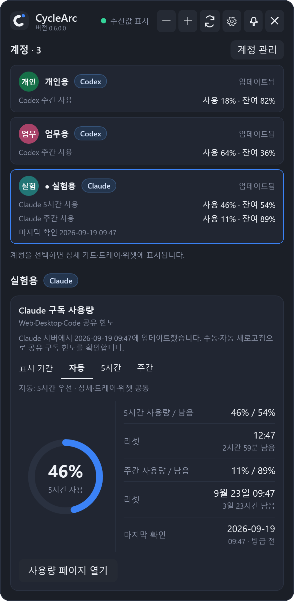
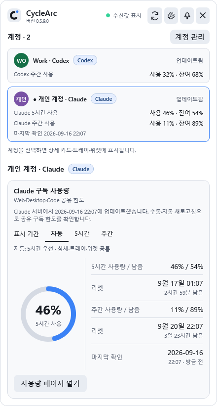
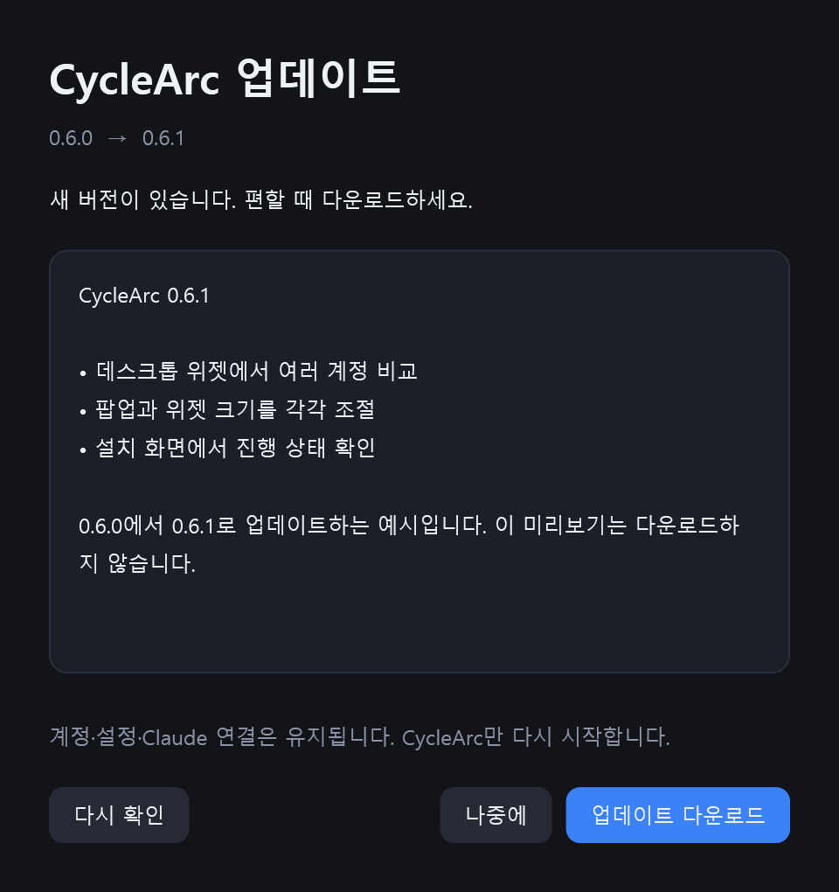

# CycleArc

[English](../README.md) · [다운로드](https://github.com/frozenvoice/cyclearc/releases/latest)

Windows 트레이에서 **여러 Codex·Claude 프로필의 사용률, 남은 비율, 리셋 시각**을 함께 확인하는 앱입니다.

계정 카드·선택한 상세 화면·트레이 툴팁·위젯의 **Codex 또는 Claude 표시**로 서비스를 구분합니다. Claude는 현재 로그인을 연결하거나 공식 브라우저 로그인을 시작하면 CycleArc가 Desktop 계정과 바인딩하고, 수동·예약 새로고침에서 공유 한도를 읽기 전용으로 확인합니다. statusLine과 Desktop 구독 사용량 기록은 로컬 기록으로 유지합니다. Gemini는 지원하지 않습니다. 기존 Codex 계정, 설정과 캐시는 유지합니다.

> **Codex:** Plus를 포함해 공식 App Server가 보내는 5시간·주간 한도를 표시합니다. 구독 이름으로 표시를 제한하지 않으며, 없는 구간은 생략하고 알 수 없는 비율은 미확인으로 표시합니다. **Claude:** 수동·자동 새로고침은 Desktop 로그인으로 서버의 공유 한도를 조회합니다. 성공하면 **업데이트됨**과 마지막 확인 시각을 표시합니다. 조회 실패 시 이전 값은 **오래된 데이터**로 표시하며, 계정 불일치 시에는 숨깁니다. 로컬 기록만 받은 경우 **수신됨**과 원래 시각을 표시하며, Desktop 기록에는 리셋 시각이 없습니다.

Codex 계정 카드에는 제공된 한도별 사용률·잔여 비율을, 상세 화면에는 리셋 시각도 함께 표시합니다. 링·트레이·위젯은 하나의 표시 기간을 공유합니다. 기본 **자동**은 확인 가능한 5시간 값을 우선하고, 없으면 주간 값을 사용합니다. 상세 원그래프 위의 **자동 / 5시간 / 주간**에서 선택하거나, 두 값이 모두 있으면 원그래프를 눌러 전환할 수 있습니다. 세 화면에 즉시 반영되며 재시작 후에도 선택을 유지합니다. 선택한 기간의 값이 없으면 확인 가능한 다른 기간을 표시하고 상세 카드에 이유를 안내합니다.

## Claude Code 연결

**Claude 구독 사용량은 Web·Desktop·Code가 공유하는 한도입니다.** CycleArc는 연결된 Claude Desktop 로그인으로 수동·예약 새로고침마다 읽기 전용으로 공유 한도를 확인합니다. 성공한 서버 결과는 **업데이트됨**과 마지막 확인 시각으로 표시합니다. statusLine과 Desktop 구독 사용량 기록은 **수신됨** 로컬 기록으로 유지되며, Web·Desktop에서 쓴 양도 같은 한도에 반영됩니다. [공식 사용 한도 안내](https://support.claude.com/en/articles/11647753-how-do-usage-and-length-limits-work).

현재 한도를 직접 확인하려면 Claude 상세 카드나 연결 창의 **사용량 페이지 열기**를 누르세요. 브라우저의 [Claude 설정 → 사용량](https://claude.ai/settings/usage)이 열립니다. 페이지를 열어도 CycleArc 값은 갱신되지 않습니다. 공식 API·CLI·SDK 문서에는 개인 구독의 현재 공유 한도를 조회하는 안정적인 공개 방법이 없습니다. CycleArc 0.6.0은 Desktop 로그인으로 Anthropic 내부 조회 경로를 호환성 목적으로 사용하며, 공식 공개 API가 아니어서 변경될 수 있습니다. [조사 근거와 결정](CLAUDE-USAGE-RESEARCH.md).

1. **계정 관리 → 계정 추가 → Claude 연결**을 여세요. 별명은 선택 사항입니다.
2. 이미 Claude CLI에 로그인했다면 **현재 로그인 연결**을 누르세요. 새로 로그인하려면 **Claude 로그인**을 누르고 공식 브라우저에서 로그인하세요. CLI 확인은 연결 설정에 사용하고, 실제 한도 조회는 연결된 Claude Desktop 로그인으로 수행합니다. 다른 설정과 기존 상태 표시줄을 보존하며, JSON을 직접 복사할 필요가 없습니다.
3. **Claude Desktop에도 같은 계정으로 로그인**한 뒤 CycleArc에서 **새로고침**을 누르세요. 수동·자동 새로고침은 모델 요청 없이 서버의 공유 한도를 직접 조회합니다. **설정 → 연결**의 자동 확인 주기는 Codex와 Claude에 함께 적용되며 기본값은 5분입니다.

Claude Code statusLine과 Desktop 구독 사용량 기록도 보조 자료로 확인합니다. 로컬 기록은 원래 관측 시각을 유지하며, 파일을 다시 읽은 것을 새 서버 조회로 표시하지 않습니다. Desktop 기록은 반영이 늦을 수 있고 리셋 시각이 없습니다.

Claude Desktop 한도 조회에서 인증이 실패하면 **Claude Desktop 로그인 필요**로 표시하고 마지막 정상값을 **오래된 데이터**로 유지합니다. 반환된 Desktop 프로필 신원이 바인딩된 계정과 다르면 해당 프로필의 Claude 사용량 전체를 숨기고 일치하는 계정으로 다시 확인할 때까지 표시하지 않습니다. 일반 요청·속도 제한 오류는 마지막 정상값을 오래된 데이터로 유지하며 재시도할 수 있습니다. 확인을 위해 모델 요청을 실행하지 않습니다.

Claude의 이메일과 조직이 같으면 요금제를 바꿔도 같은 계정으로 유지합니다. 재로그인 뒤 이전 연결 세대에서 도착한 콜백은 최신 사용량이나 수신 시각을 바꾸지 않습니다. 이전 형식의 저장된 연결은 신원을 확인한 뒤 전환합니다. 자세한 내용은 [연결 호환성](CLAUDE.md#account-identity-compatibility)을 참고하세요.

**CycleArc는 연결된 Claude Desktop 로그인으로 공유 한도를 적극 확인합니다.** Claude Code statusLine과 Claude Desktop 기록은 로컬 기록입니다. 서버 조회 또는 로컬 기록의 첫 유효 샘플 전에는 **수신 대기**로 표시할 수 있습니다. 서버 조회 성공은 **업데이트됨**과 서버 확인 시각, 로컬 기록은 **수신됨**과 원본 시각을 표시합니다. 여러 로컬 기록이 있으면 더 최근 관측값을 사용합니다. **현재 로그인 연결**을 반복해도 같은 바인딩과 사용량 이력을 유지합니다. 새 연결을 취소하면 빈 임시 프로필만 정리합니다.

<details>
<summary><strong>연결 완료·사용량 수신 대기 · 다크와 라이트</strong></summary>

<p> </p>

</details>

<table>
  <tr><td align="center"><strong>자동 연결 · 다크</strong></td><td align="center"><strong>자동 연결 · 라이트</strong></td></tr>
  <tr>
    <td></td>
    <td></td>
  </tr>
</table>

*아래에서는 Codex 계정 2개와 함께 실험용 Claude를 선택했습니다. 가상 서버 데이터(5시간 46%, 주간 11%, 리셋 시각)로 **업데이트됨** 상태를 보여주며, 실제 로그인에는 접근하지 않습니다.*

<table>
  <tr><td align="center"><strong>Claude 서버 조회 · 다크</strong></td><td align="center"><strong>Claude 서버 조회 · 라이트</strong></td></tr>
  <tr>
    <td></td>
    <td></td>
  </tr>
</table>

statusLine JSON에는 **계정 이메일·계정 ID가 없고**, Desktop 기록에는 이메일 대신 조직 ID가 있습니다. 서버 조회는 앱 소유 config.json과 Local State에서 필요한 보호 OAuth 토큰을 읽어 메모리에서만 DPAPI/AES-GCM으로 복호화하고, 바인딩된 신원과 프로필 응답의 이메일과 조직 ID을 확인한 뒤 사용량을 요청합니다. Desktop 자격 증명을 쓰거나 갱신하지 않고 쿠키를 읽거나 토큰을 저장하지 않습니다. 신원이 다르면 해당 프로필의 Claude 사용량 전체를 숨기며 마지막 정상값을 대체하지 않습니다. 이메일은 화면 표시를 위해 메모리에만 둡니다.

서버 조회가 성공하면 **업데이트됨**과 서버 확인 시각을 표시합니다. statusLine과 Desktop 기록은 **수신됨**과 원본 시각을 유지합니다. 인증·속도 제한·일반 요청 실패는 마지막 정상값을 **오래된 데이터**로 유지하고, 신원 불일치는 해당 프로필의 Claude 사용량 전체를 숨깁니다. 수동·예약 새로고침은 서버 조회를 시도하며 2초 확인은 로컬 소스만 읽습니다. 소스에 없는 리셋 시각은 추정하지 않고 사용률을 로컬에서 0으로 되돌리지 않습니다. Claude에는 Codex 리셋권 기능을 표시하지 않습니다.

<details>
<summary><strong>Claude Desktop 로컬 기록 · 다크와 라이트</strong></summary>

<p>이 별도 예시는 Claude Desktop 로컬 기록입니다. 5시간 91%, 주간 47%를 표시하고 리셋 시각은 미확인으로 둡니다. <strong>수신됨</strong>과 원래 관측 시각을 표시하며, 서버 조회 실패가 있으면 이전 값을 오래된 데이터로 표시합니다. 나머지 Codex 계정 2개는 최신 상태입니다.</p>
<table>
  <tr>
    <td></td>
    <td></td>
  </tr>
</table>

</details>

**연결 상세 설정 → 연결 해제**는 해제 상태를 먼저 저장한 뒤 기존 상태 표시줄을 복원하고 CycleArc의 오류 수신 훅을 제거합니다. 계정 관리에는 프로필과 마지막 정상 캐시를 남기며 Claude 자체를 로그아웃하지 않습니다. 다시 연결하면 서버 조회 또는 로컬 기록이 성공할 때까지 **수신 대기**로 표시합니다.

연결 중 statusLine 명령이 너무 길다는 안내가 나오면 기존 인라인 statusLine을 스크립트 파일로 옮기고 짧은 호출 명령을 사용한 뒤 다시 연결하세요. 제한은 경로와 인코딩된 옵션을 포함한 전체 생성 명령에 적용하며, 설정 실패 시 기존 파일은 보존합니다.

사용량은 연결된 Desktop의 읽기 전용 한도 확인을 먼저 사용하고, 공식 statusLine과 Claude Desktop 사용량 기록을 로컬 기록으로 사용합니다. 서버 조회는 config.json과 Local State의 보호 OAuth 토큰을 메모리에서만 DPAPI/AES-GCM으로 복호화하고 프로필 응답의 이메일과 조직 ID을 바인딩된 신원과 확인한 뒤 사용량을 요청하고 토큰을 버립니다. Desktop 자격 증명을 쓰거나 갱신하지 않고 쿠키·대화·트랜스크립트를 읽지 않으며 모델 요청을 실행하지 않습니다. 이 조회 경로는 공개 API가 아닌 내부 호환성 의존성입니다. 원본 기록 대신 한도 수치·소스·상태·연결 경로·신원 구분용 해시만 저장합니다. [연동 상세](CLAUDE.md) · [Desktop 조사 근거](CLAUDE-USAGE-RESEARCH.md) · [Claude Code 공식 문서](https://code.claude.com/docs/en/statusline)

ChatGPT Pro/Sol 기록 추정 기능은 종료했습니다. Edge/Chrome 확장, 별도의 ChatGPT 기록 접근,
대화 기록 동기화, SQLite 기록 집계, WebView2는 현재 앱에서 사용하지 않습니다.

## 다중 계정 미리 보기

**Codex는 확인한 로그인과 프로필의 연결을 유지합니다.** **로그인 변경 감지** 또는 **연결 확인 필요**가 표시된 프로필은 메인에 남고, 사용량과 리셋권은 숨깁니다. 선택 중이었다면 상세 화면·트레이·위젯도 그 프로필을 유지합니다. [Codex 연결 복구](#codex-연결-복구)에서 해결 방법을 확인하세요.

**연결된 Claude는 첫 사용량이 없어도 메인에 표시합니다.** **수신 대기**와 미확인 한도를 보여주며 확인 필요 개수에는 포함하지 않습니다. 미연결 프로필은 **계정 관리**에 남고 메인 계정 수에는 포함하지 않습니다. 사용량을 받은 뒤 일시적으로 업데이트가 늦어지는 계정은 이전 데이터로 계속 표시합니다. 팝업과 트레이는 선택한 계정을 보여주고, 위젯은 표시 가능한 계정을 모두 나열하면서 선택한 계정을 표시합니다. 표시할 계정이 하나도 없으면 팝업에 연결 안내를 보여주고 위젯은 숨깁니다.

<table>
  <tr>
    <td align="center"><strong>사용량 수신 계정 2개 · 다크</strong></td>
    <td align="center"><strong>사용량 수신 계정 2개 · 라이트</strong></td>
  </tr>
  <tr>
    <td></td>
    <td></td>
  </tr>
</table>

*실제 앱 화면에 가상 데이터만 넣어 만든 문서용 이미지입니다. 실제 사용자의 계정을 캡처하지 않았으며, 이름·`example.invalid` 이메일·사용률·리셋 시각·리셋권은 모두 예시입니다.*

화면은 위의 계정 목록부터 아래 상세 카드 순서로 읽으면 됩니다.

1. **계정별 사용량을 비교합니다.** 개인용 18%, 업무용 64%는 각각의 Codex 주간 한도에 대한 사용률입니다. 서로 다른 계정의 비율이나 리셋권을 합산하지 않습니다.
2. **자세히 볼 계정을 선택합니다.** 파란 테두리와 점이 있는 업무용이 현재 선택 계정입니다. 큰 링의 **사용 64%**, 오른쪽 행의 **남음 36%**, 아래 리셋권도 모두 업무용 계정의 정보입니다. 다른 카드를 누르면 상세 화면·트레이·위젯의 표시 계정이 바뀝니다. 이 선택으로 다른 Codex 앱의 로그인 계정이 바뀌거나 새로고침이 시작되지는 않습니다.
3. **미연결 프로필은 계정 관리에 남습니다.** 이전에 등록한 실험용 Claude는 연결되지 않아 이 메인 화면에는 나오지 않습니다. 등록된 프로필은 3개여도 **계정 · 2**, **전체 최신**으로 표시합니다. 연결을 완료하면 첫 사용량이 없어도 메인에 표시됩니다.

## 설치와 실행

배포 파일은 **`CycleArc-Setup.exe`**입니다. Velopack 1.2.0 기반 설치기가 필요한 앱 파일을 관리하며 .NET 런타임이 포함되어 별도 .NET 설치가 필요 없습니다.

[최신 릴리즈](https://github.com/frozenvoice/cyclearc/releases/latest)에서 **Release · Windows x64** 설치 프로그램을 다운로드해 실행하세요. 안정 설치는 `%LOCALAPPDATA%\CycleArc` 아래에 두고, 사용자 설정·계정·사용량 캐시는 기존 `%LOCALAPPDATA%\ProMeter`에 유지합니다.

설치된 정식 버전은 시작 20초 뒤와 이후 6시간마다 GitHub Releases의 정식 채널을 확인합니다. 변경 내용과 함께 새 버전이 표시되며 **업데이트 다운로드**를 누른 뒤 **재시작 후 적용**을 선택해야 적용됩니다. **나중에** 또는 취소를 선택할 수 있으며 시작 시 자동 적용하지 않습니다. 전체 `.nupkg`는 다운로드 직후와 Velopack 적용 직전에 SHA-256을 확인합니다.

교체 전에 이전 앱의 검증된 사본을 설치 폴더 밖에 보관합니다. 파일 교체에 실패하거나 새 앱이 준비 완료 신호를 보내지 못하면 별도 복구 프로세스가 이전 버전을 복원하고 다시 실행합니다. 계정과 설정은 앱 파일과 분리해 유지합니다. 복구까지 막히면 백업을 보존하고 위치를 안내합니다. 이 확인은 시작 단계에 적용되며, 이후 사용 중 발생하는 모든 오류를 감지하는 기능은 아닙니다.

<details>
<summary><strong>업데이트 화면 예시</strong></summary>

<p></p>
<p>가상의 0.6.1 변경 내용으로 렌더링한 실제 WPF 화면입니다. 다운로드가 끝나도 앱은 종료되지 않으며 검증 후 재시작 후 적용 버튼을 눌러야 합니다.</p>

</details>

릴리즈 파이프라인에서 코드 서명을 설정하지 않은 경우 배포 자산은 서명되지 않습니다. 설치 프로그램만으로 Windows SmartScreen 경고가 사라지지는 않습니다.

실제 데스크톱 앱은 `%LOCALAPPDATA%\CycleArc\current\CycleArc.exe`에서 실행합니다. `%LOCALAPPDATA%\CycleArc\CycleArc.exe`는 데스크톱과 Windows 시작용 안정 런처이며, Claude statusLine·오류 훅은 stdin/stdout 전달을 보장하기 위해 current 실행 파일을 직접 사용합니다. 기존 CycleArc 소유 콜백은 CLI 신원과 저장된 바인딩이 일치할 때만 새 경로로 옮기며, 이전 실행 파일이 이미 없어도 설정에 있는 정확한 소유 wrapper라면 옮길 수 있습니다. 기존 statusLine, 별명, 계정 연결, 관련 없는 설정과 훅은 보존합니다.

처음 설치할 때 현재 세션의 IPC와 실행 파일을 확인할 수 있으면 예전 표준 설치의 데스크톱을 종료하고 새 설치를 실행합니다. 다른 경로에서 실행 중인 개발 빌드는 먼저 실행된 인스턴스 정책을 유지합니다. 예전 `%LOCALAPPDATA%\Programs\CycleArc` 경로는 개발 호환성을 위해 남아 있지만 GitHub 업데이트 확인 대상이 아닙니다.

**설정 → 앱**에서 제거하거나 `Update.exe --uninstall`을 실행하면, 설치 파일을 지우기 전에 이 설치가 바꾼 Claude 설정을 되돌립니다. 이번에 제거하는 설치가 소유한 콜백만 정리합니다. 이전 statusLine은 원래 모습 그대로 복원하고 CycleArc 오류 훅은 제거하며, 사용자가 직접 바꾼 statusLine·다른 도구의 훅·다른 CycleArc 설치가 소유한 wrapper는 건드리지 않습니다. `%LOCALAPPDATA%\ProMeter`의 계정·설정·사용량 기록·Claude 연결 정보는 삭제하거나 로그아웃하지 않으므로 다시 설치하면 그대로 사용할 수 있습니다. 정리는 제한 시간 안에서만 수행하며 제거를 지연시키지 않습니다. 설정 파일이 잠겨 있거나 손상됐거나 동시에 편집 중이면 파일을 그대로 두고 결과를 `%LOCALAPPDATA%\ProMeter\claude-uninstall-cleanup.json`에 기록합니다.

Codex 조회에는 이 PC에 설치된 **Codex CLI**, 구독 한도를 제공하는 ChatGPT 계정으로의 CLI 로그인과 네트워크 연결이 필요합니다. Claude 서버 조회에는 공식 Claude CLI의 연결 확인, Windows PowerShell, 로그인된 Claude Desktop과 Claude Pro·Max 계정이 필요합니다. statusLine과 Claude Desktop 구독 사용량 기록은 로컬 기록으로 사용할 수 있습니다. Codex 로그인은 필요하지 않습니다. 두 서비스 모두 CycleArc에서 공식 로그인을 시작할 수 있습니다.
앱은 `codex.exe` 또는 `codex.cmd`를 PATH와 일반 설치 위치에서 찾습니다.
자동으로 찾지 못하면 트레이 메뉴 → 설정에서 실행 파일의 절대 경로를 지정하세요.
Codex CLI 자체는 이 배포 파일에 포함하지 않습니다.

## 계정 추가와 연결

팝업의 **계정 관리** 또는 **설정 → 연결 → Codex·Claude 계정 관리**를 여세요.

- **계정 추가 → 새 계정 로그인**: 처음 Codex를 사용하거나 다른 Codex 계정을 추가할 때 선택하세요. 브라우저에서 사용할 ChatGPT 계정을 선택하고 돌아오면 사용량을 자동으로 확인합니다. 독립된 Codex 홈을 사용하므로 기존 Codex 로그인은 유지됩니다.
- **계정 추가 → Claude 연결**: 현재 Claude 로그인을 연결하거나 공식 브라우저에서 로그인합니다. 사용량 수신 설정은 자동으로 적용합니다.
- **이 PC의 계정 찾기**: 이미 이 PC의 Codex CLI에 로그인한 계정을 연결합니다. 기본 `~/.codex`와 프로세스·사용자·시스템 `CODEX_HOME`을 공식 `account/read`로 확인하며 시작할 때도 자동으로 찾습니다. ChatGPT 웹에만 로그인한 계정은 대상이 아닙니다.
- **고급 · Codex 폴더 직접 연결**: `CODEX_HOME`을 별도로 지정해 사용하던 경우에만 필요합니다. Codex 홈 폴더를 선택하며 실행 파일이나 작업 프로젝트 폴더를 고르는 기능이 아닙니다. 디스크 전체를 검색하거나 인증 파일을 읽고 복사하지 않습니다.
- 사용량이 있는 계정 카드를 선택하면 상세 링과 트레이·위젯이 해당 계정을 표시합니다. 리셋권 카드는 Codex에만 있습니다. 표시 계정 수에 2개 제한은 없습니다.
- **순서 ↑ / ↓**: 계정을 위·아래로 옮깁니다. 사용량 팝업에도 같은 순서가 적용되고 즉시 저장되어 재시작 후 유지됩니다. 표시 순서를 바꿔도 선택 계정은 그대로이며 새로고침을 시작하지 않습니다.
- **별명 저장**: CycleArc에서 표시할 이름을 정합니다. 비워서 저장하면 제공된 이메일이나 서비스·프로필 이름을 표시합니다. 원형 아이콘은 이름의 앞 두 글자와 고정된 계정 색상으로 이 앱에서 만듭니다. 별명·아이콘은 서비스의 웹 프로필과 별개입니다.
- **다시 연결**: 기존 Codex에서 가져온 프로필에 독립된 로그인을 연결합니다. 사용량 확인 후 별명·순서·선택 상태를 유지하며 연결을 교체합니다.
- **다시 로그인**: CycleArc에서 별도로 로그인했거나 **다시 연결**로 복구한 Codex 프로필의 로그인을 갱신하거나 변경합니다. Claude 프로필은 **연결** 버튼을 사용합니다.
- **제거**: 목록에서 연결 정보만 잊으며 Codex 로그인·홈·사용량 캐시는 삭제하지 않습니다. 제거한 홈은 자동으로 다시 추가되지 않으며 폴더 선택으로 다시 연결할 수 있습니다.

위젯은 계정이 1개여도 계정 이름을 표시합니다. 별명이 없으면 이메일을, 이메일도 없으면 기존 제공자·프로필 이름을 표시합니다. 긴 이름은 모듈 안에서 말줄임으로 표시하고 전체 이름은 툴팁에 남습니다.

**별명·아이콘과 버튼 사용 안내**를 펼치면 각 동작의 설명을 볼 수 있습니다. 정상 조회 이력이 없는 첫 사용에는 연결 방법이 자동으로 펼쳐지며, 이미 연결한 계정이 있으면 목록부터 표시합니다. 설명이 길어져도 본문 전체를 스크롤할 수 있습니다.

<details>
<summary><strong>계정 관리 예시 · 다크</strong></summary>

<p>계정 관리에는 미연결 상태인 실험용 Claude까지 등록된 프로필 3개가 남습니다. 실험용의 요약 카드는 아직 선택할 수 없지만 연결·별명 저장·순서 변경은 가능합니다. 메인 팝업은 사용량이 있는 Codex 2개만 셉니다. 순서를 바꿔도 선택한 업무용 계정은 유지됩니다.</p>
<p></p>

</details>

<details>
<summary><strong>계정 관리 예시 · 라이트</strong></summary>

<p></p>

</details>

새 로그인과 **다시 연결**로 복구한 로그인은 `%LOCALAPPDATA%\ProMeter\accounts\<로컬 ID>\codex-home`에 분리됩니다.
인증 정보 저장과 갱신은 설치된 Codex가 수행합니다. 기존 홈에서 가져온 프로필은 **다시 연결**로 독립된 로그인을 만들기 전까지 원래 Codex 설치와 연결됩니다.
로그인 중에도 다른 계정의 사용량 조회는 가능합니다.

Codex가 설치되지 않았다면 [공식 Codex CLI 안내](https://developers.openai.com/codex/cli/)에 따라 설치한 뒤 다시 로그인하세요.

- 트레이 아이콘 클릭: 사용량 화면 열기/닫기
- 새로고침: Codex App Server와 Claude 서버에서 연결된 계정의 한도를 조회하며, Claude는 Desktop의 기존 로그인을 사용합니다
- 카드 상단 톱니바퀴: 설정 열기
- 작업표시줄: Windows 알림 영역의 사용률 아이콘을 사용하며 다른 앱 아이콘 위에 겹치지 않습니다
- 자동 확인: Codex는 설정 → 연결에서 1·2·5·10·30·60분 선택 (기본값 5분), Claude는 설정한 주기로 Claude 서버 한도를 확인하고 2초 주기로 statusLine·Desktop 로컬 기록을 확인
- 위젯의 계정 클릭: 그 계정을 선택하고 사용량 화면을 열거나, 다른 창 뒤에 있는 화면을 한 번에 앞으로 가져오기
- 선택 기능: 플로팅 위젯, Windows 시작 시 실행
- 첫 실행은 화면을 표시하고 이후에는 트레이로 시작합니다. `--show`로 화면을 열며 시작할 수 있습니다.

Plus를 포함해 서버가 제공하는 한도 기간을 표시하며,
없는 값을 0으로 표시하거나 남은 요청 횟수로 환산하지 않습니다.
일시적인 조회 실패는 마지막으로 확인한 정상값을 이전 데이터로 표시할 수 있습니다. 재시작 후에는 Codex 로그인과 프로필의 연결을 확인한 뒤 캐시를 표시합니다. 로그인이 달라졌거나 확인할 수 없으면 사용량과 리셋권 사용을 숨깁니다.
실패 직후 팝업을 다시 열어도 2분 동안 자동 재시도를 억제하며, 수동 새로고침은 즉시 사용할 수 있습니다.
큰 사용량 링과 수치 목록 아래에 리셋권 카드를 따로 표시합니다. 제목 옆 보유 수 배지를 누르면 안내가 열리고, 오른쪽 화살표로 목록을 접거나 펼칠 수 있습니다.
리셋 시각 아래에는 남은 일·시간을 표시하고, 서버가 제공하면 리셋권 만료일을 스크롤 목록으로 표시합니다.
일부 만료일만 제공된 경우 그 사실을 표시하며, 정확한 시각은 툴팁에서 확인할 수 있습니다.
남은 시간 표시는 1분마다 갱신되며 추가 서버 요청은 하지 않습니다.
마지막 확인에는 `21:05 · 3분 전`처럼 마지막 성공 이후 경과 시간도 표시하며, 같은 1분 타이머로 갱신합니다.
사용량과 남은 비율은 `주간 사용량 / 남음 — 29% / 71%`처럼 한 행에 표시합니다.
상세의 **자동 / 5시간 / 주간**에서 기간을 고르면 원그래프·트레이·위젯이 함께 바뀌고 선택이 저장됩니다. 두 값이 모두 있으면 원그래프를 눌러 5시간과 주간을 전환할 수도 있습니다.
상세 팝업에서 `Ctrl + +` / `Ctrl + -`로 표시 크기를 10%씩 조절합니다(80~150%).
`Ctrl + 0`은 기본 크기로 복원하며 숫자패드도 지원합니다. 선택한 크기는 저장됩니다.
글자가 겹치지 않도록 팝업 전체가 함께 확대·축소되며, 화면보다 커지지 않게 제한됩니다.

위젯은 표시 가능한 Codex·Claude 계정을 계정 관리 순서 그대로 작은 모듈로 나란히 보여줍니다. 각 모듈에는 계정 이름과 제공자 표시, 공유 표시 기간의 사용률 링, 그리고 그 계정이 제공하는 **모든 기간**의 남은 한도와 리셋까지 남은 시간이 있습니다. 계정 사용량을 합산하지 않으며 사용량 순으로 재정렬하지도 않습니다. 한 줄에는 위젯이 놓인 모니터의 작업 영역이 허용하는 만큼만 배치하고 나머지는 다음 줄로 넘깁니다. 작업 영역보다 높아지면 위젯 안에서만 세로로 스크롤합니다.

위젯의 빈 곳이나 헤더를 드래그하면 위치가 저장되고, 드래그가 끝났다고 상세 카드가 열리지는 않습니다. 계정 모듈을 짧게 클릭하면 그 계정을 선택하고 상세 카드를 엽니다. 클릭만으로 새 로그인이나 사용량 조회를 시작하지는 않습니다. 헤더의 설정·닫기 버튼은 각각 설정 창을 열고 위젯만 숨깁니다(CycleArc는 계속 실행됩니다). 우클릭 → 위젯 닫기로 숨기고 설정에서 다시 켤 수 있습니다. 클릭 통과를 켜면 위젯은 마우스 입력을 받지 않으며, 트레이 메뉴와 설정에서 해제할 수 있습니다.
Codex 모듈은 정상 상태 문구를 숨기고 조회 실패·로그인 필요·이전 데이터처럼 확인이 필요한 상태를 별도 줄로 표시합니다. Claude 모듈에는 서버 조회 **업데이트됨** 또는 로컬 기록 **수신됨**·오래된 데이터 상태를 표시하고, 마지막 확인·수신 시각과 출처 설명은 모듈 툴팁에 남깁니다. 리셋은 "35분 후"처럼 표시하고 정확한 날짜·시각은 툴팁에서 확인합니다. 리셋 시각이 제공되지 않으면 **리셋 미제공**으로, 이미 지난 시각은 **갱신 대기**로 표시하며 로컬에서 새 주기를 추정하지 않습니다.
설정은 일반·위젯·연결 탭으로 나뉩니다. 기존 작업표시줄 오버레이 설정은 해제됩니다.
시스템 테마를 선택하면 Windows 테마 변경을 바로 반영합니다.
화면 밖으로 벗어난 위젯은 연결된 화면 안으로 복구하며, 설정 → 위젯 → 위치 초기화 후 저장하면 기본 화면으로 이동하고 위젯 창도 새로 만듭니다. Windows가 표시 중으로 보고하는데 위젯이 보이지 않는 경우에도 복구할 수 있습니다.
위젯 표시가 켜져 있고 표시할 계정이 있으면 2초마다 실제 창 상태와 앞뒤 순서를 확인해 예기치 않은 숨김·최소화, 항상 위 설정이 켜져 있는데 일반 창 뒤로 밀린 상태를 복구합니다. 키보드 포커스는 가져오지 않습니다. 절전 복귀·잠금 해제·화면 변경 뒤에는 저장된 위치·투명도·입력 설정을 유지해 창을 다시 만듭니다. 위젯을 직접 끄면 숨김 상태를 유지하며, 자동 복구 내역은 로컬 앱 로그에 남습니다.
설정은 원자적으로 저장하고 이전 정상 파일을 백업하여 파일 손상 시 자동 복구합니다.
트레이 아이콘이 숨겨져 있으면 Windows 알림 영역의 펼치기 메뉴에서 꺼내 배치할 수 있습니다.

트레이의 **사용률 숫자**는 투명 배경에 글꼴의 원래 비율을 유지한 굵은 숫자를 아이콘 공간에 맞춰 최대한 크게 표시합니다. **%** 기호는 생략하며, **67**은 **67% 사용**을 뜻합니다. 앱 테마와 별개로 Windows 작업표시줄이 어두우면 흰색, 밝으면 어두운 글자를 사용합니다. 선택한 계정의 사용률이며, 상세 카드에서 고른 표시 기간을 따릅니다. **자동**은 확인 가능한 5시간 값을 우선하고, 없으면 주간 값을 사용합니다. 실제 표시 중인 기간은 툴팁에서 확인할 수 있습니다. 기간 전환은 이미 받은 값의 표시만 바꾸며 수신 시각이나 사용량을 갱신하지 않습니다. 알 수 없는 값은 **?**로 표시합니다. 상태와 수신 시각은 툴팁이나 상세 카드에서 확인할 수 있습니다. 선택 가능한 **사용률 링**은 기존 상태 색상을 유지합니다. 파랑은 정상 수신값, 빨강은 정상 수신값의 사용률 100%, 노랑은 이전 데이터 또는 조회·연결 문제입니다. 알 수 있는 값이 없으면 회색 링에 **?**를 표시합니다.

### Codex 연결 복구

별명은 CycleArc의 표시 이름입니다. 다른 프로필과 같은 로그인 이메일이라는 안내는 두 프로필이 같은 로그인 이메일을 보고한다는 뜻이며, 공식 프로토콜만으로는 같은 이메일의 서로 다른 워크스페이스를 구분할 수 없습니다. 기존 Codex 홈에서 가져온 프로필이 CycleArc에서 별도로 로그인한 프로필과 일치하면, 가져온 프로필에 **연결 확인 필요**를 표시하고 사용량과 리셋권을 숨깁니다. 이 충돌은 재시작하거나 같은 로그인의 다른 프로필을 제거해도 재연결 전까지 유지됩니다. 저장된 계정 연결을 검증할 수 없을 때도 **연결 확인 필요**로 표시합니다.

1. **계정 관리**에서 해당 Codex 프로필을 찾으세요. 기존 Codex에서 가져온 프로필은 **다시 연결**, CycleArc에서 관리하는 로그인은 **다시 로그인**을 누릅니다.
2. 공식 브라우저 로그인 화면에서 사용할 계정을 선택하고 인증을 완료하세요.
3. **다시 연결**은 로그인과 사용량을 확인한 뒤 기존 연결을 교체하며 별명·목록 순서·선택 상태를 유지합니다. 취소하거나 이미 연결된 계정을 고르거나 사용량 확인에 실패하면 기존 연결을 유지합니다.

브라우저 로그인은 5분 이내에 완료해야 하며 취소할 수 있습니다. 시간이 초과된 뒤 브라우저에서 localhost에 연결할 수 없다고 나오면, 같은 프로필의 로그인 버튼을 다시 눌러 새 인증을 시작하세요.

## 이전 버전에서 전환

- 기존 설정과 캐시는 호환성을 위해 `%LOCALAPPDATA%\ProMeter`에 그대로 보관합니다.
- 이전 대화 기록 DB는 삭제하거나 열지 않습니다. 기록 동기화는 실행하지 않습니다.
- 앱 시작 시 이 사용자 데이터 폴더의 manifest를 가리키는 기존 Native Messaging 등록만 해제합니다.
- 브라우저의 **ProMeter ChatGPT Companion** 확장은 더 이상 필요 없습니다. 브라우저 확장 관리 화면에서 제거하세요.
- 새 릴리즈의 `CycleArc-Setup.exe`를 실행하세요. 첫 설치는 확인 가능한 예전 표준 데스크톱을 정리하고 `%LOCALAPPDATA%\ProMeter`의 데이터와 기존 Claude 연결을 유지합니다.

## 개발

제품명과 배포 파일, 솔루션 `CycleArc.sln`, 프로젝트·폴더·네임스페이스는 모두 `CycleArc`로 통일합니다.
`src/CycleArc`는 현재 WPF 앱, `src/CycleArc.Core`는 Codex·Claude 연동과 표시·저장 로직 및 남아 있는 레거시 로직,
`tests/CycleArc.Tests`는 회귀 테스트입니다. `src/CycleArc.CompanionHost`는 배포되지 않는 이전 Native Messaging 호스트입니다.
이전 설치의 데이터 경로와 레지스트리·프로세스 식별자는 `LegacyInstallation`에 모아 유지합니다.
이 값은 현재 제품명이 아니라 기존 데이터 접근과 이전 설치 정리를 위한 호환성 키입니다.

```powershell
.\dev-run.ps1
```

저장소 루트의 **`build-local.cmd`**를 더블클릭하면 현재 체크아웃을 빌드하고 `CycleArc-Setup.exe`를 만든 뒤, 관리형 Velopack 위치(`%LOCALAPPDATA%\CycleArc` 또는 이미 등록된 InstallLocation)에 설치하고 `%LOCALAPPDATA%\CycleArc\CycleArc.exe`를 실행합니다. 내부에서 `dev-run.ps1 -NoLaunch`를 별도 프로세스로 돌린 다음 설치기를 사용하며, 개발용 EXE를 `%LOCALAPPDATA%\Programs\CycleArc`에 복사하지 않습니다.

실행 중인 데스크톱은 검증 게이트가 통과하고 이번 실행의 Setup.exe가 준비된 뒤에만 종료합니다. 종료는 현재 사용자 세션에서 신원이 확인된 데스크톱 IPC 요청으로만 하며 이름 기반 일괄 종료는 쓰지 않습니다. 따라서 빌드가 실패하면 설치된 앱은 그대로 실행 중으로 남습니다. 실패하면 `artifacts\build-local\last-failure.txt`에 기록된 실제 실패 단계(`Failed at:`와 `ui-smoke-desktop-instance` 같은 하위 단계. `Stage: build`로 뭉개지 않음)를 창에 출력하므로, Setup.exe가 이미 시작된 뒤의 실패를 "기존 설치는 그대로"라고 잘못 안내하지 않으며 0이 아닌 종료 코드가 CMD까지 전달됩니다. `dev-run.ps1`의 표준 출력과 오류는 `artifacts\build-local\dev-run.out.log`와 `dev-run.err.log`에 남고, 게이트가 실패하면 그 파일의 끝부분을 같은 창에 출력하므로 UiSmoke 오류를 바로 볼 수 있습니다. 성공 시에는 각 단계 소요 시간만 출력하고 그 로그를 전부 덤프하지는 않습니다.

`.\dev-run.ps1`은 기존 개발용 게시 경로입니다. 실패를 빨리 보도록 restore와 Release 컴파일 다음에 데스크톱 인스턴스 프로세스 검사, 설치/build-local 스크립트 회귀, 단위 테스트, 나머지 WPF 검사, 그다음 게시·패키지·패키지 검증 순으로 실행한 뒤 디버그 심볼을 제외한 개발용 Windows x64 단일 파일을 게시·실행합니다. 개발용은 각 PC의 `%LOCALAPPDATA%\Programs\CycleArc\CycleArc.exe`를 사용하며, 안정 Velopack 설치 `%LOCALAPPDATA%\CycleArc`와 분리되어 GitHub 업데이트 대상이 아닙니다. 빌드 임시 파일은 현재 작업 폴더에 남으며 `-NoLaunch`는 설치된 앱을 교체하지 않습니다. 파일 교체가 실패하면 이전 파일을 복원할 수 있지만, 파일 롤백이 새 앱의 시작 상태까지 보장하지는 않습니다.
CI는 개발용 단일 파일을 검사하고 안정 배포용 Velopack 설치 자산을 패키징합니다. 수동 릴리즈 스크립트는 CI 자산의 버전과 SHA-256을 확인한 뒤 게시합니다.
시작 시 실행 중인 앱의 PID와 경로를 표시합니다. 빌드 산출물에서 직접 실행 중인 앱은 정리 전에 경로와 PID를 알려주므로, 해당 앱을 종료한 뒤 다시 실행하세요.
`-NoLaunch`는 검증된 파일을 staging에만 만들고 실행 중인 앱을 건드리지 않습니다.

### 실행 및 버전 전환

일반 실행은 **먼저 실행된 앱을 유지**하고 해당 창과 실행 중인 버전을 표시합니다. 개발용과 릴리즈 사이에 고정 우선순위는 없습니다. Windows 자동 시작은 공통 설치 경로를 사용하며 기존 창을 앞으로 가져오지 않습니다.

안정 버전은 설치된 앱의 업데이트 UI에서 바꿉니다. 현재 소스 빌드는 `dev-run.ps1`을 사용하며, 개발용과 안정 설치 사이에는 고정 우선순위가 없습니다. 이미 실행 중인 개발 빌드는 먼저 실행된 인스턴스 정책을 유지합니다.

설정·계정·캐시는 기존 `%LOCALAPPDATA%\ProMeter`에 유지합니다. 안정 설치의 실제 앱은 `%LOCALAPPDATA%\CycleArc\current\CycleArc.exe`이며, `%LOCALAPPDATA%\CycleArc\CycleArc.exe`는 데스크톱과 Windows 시작용 안정 런처입니다. Claude 콜백은 stdin/stdout 전달을 위해 current 실행 파일을 직접 사용하며, 일치하는 CLI 신원과 저장된 바인딩을 확인한 뒤 기존 소유 wrapper를 옮깁니다. 확인된 이전 트레이 항목은 새 트레이 아이콘이 준비된 뒤 레지스트리 값을 백업하고 정리합니다.
`-Fast`는 같은 변경에 대한 전체 테스트를 이미 통과했을 때만 사용하세요.

`scripts/Verify-InstalledUpdate.ps1`은 설치된 앱을 처음부터 끝까지 검증합니다. 버전과 해시가 실제로 다른 테스트 빌드 3개를 만들어 첫 번째를 실제 `Setup.exe`로 설치하고, 운영 업데이트 창·조정자·업데이터·복구 supervisor를 그대로 거쳐 두 번째로 업데이트한 뒤, 준비 완료 전에 종료하는 빌드를 적용해 supervisor가 이전 버전을 복원·재실행하는지 확인하고, 마지막으로 앱을 제거해 Claude 설정 복원과 데이터 보존을 검사합니다. 현재 Windows 사용자 계정에 실제로 설치·업데이트·제거하며 데이터 루트·제거 레지스트리 항목·바로가기·단일 인스턴스 mutex·데스크톱 IPC는 격리할 수 없으므로, 폐기 가능한 Windows VM이나 전용 테스트 사용자에서 `-ConfirmDisposableEnvironment`와 함께만 실행하세요. 업데이트 피드는 테스트 전용 빌드 플래그에서만 읽는 로컬 디렉터리이며 HTTPS 강제와 패키지 검증은 그대로입니다. Claude 계정은 합성 데이터이며 실제 구독 사용량 검증이 아닙니다.

GitHub Actions는 개발용 단일 파일 검사물과 Velopack 설치 자산을 함께 생성합니다.

GitHub 릴리즈는 버전을 반영한 변경을 커밋·푸시하고 로컬 `-NoLaunch` 검사와 Windows CI를 통과한 뒤 `pwsh -NoProfile -File ./scripts/Release.ps1 -Version 0.6.0 -NotesPath "./release-notes/0.6.0.md"`로 게시합니다. 설명 파일 경로는 준비한 파일로 바꾸세요. `-Preflight`는 같은 로컬·패키지·원격 검사를 태그 생성, 초안, 업로드, 공개 없이 수행합니다.

이 명령은 해당 커밋의 CI 실행 파일과 설치 자산을 받아 버전과 업로드된 SHA-256을 검사한 뒤 초안을 공개합니다.
기존 초안 설명은 보존하며, 새 릴리즈에는 `-NotesPath <파일>`이 필요합니다.
공개된 파일과 기존 태그의 대상 커밋은 덮어쓰지 않습니다. 게시 단계는 새 빌드·테스트·패키징을 시작하지 않습니다.

## 데이터와 구현

Codex는 공식 App Server로 계정·사용 한도를 조회합니다. Claude는 연결된 Desktop의 보호 OAuth 토큰을 메모리에서만 복호화해 Anthropic의 계정·사용량 조회 경로를 읽기 전용으로 조회하고, statusLine과 Claude Desktop 기록을 로컬 기록으로 사용합니다. 프로필의 이메일·조직 ID와 바인딩된 신원이 다르면 해당 프로필의 Claude 사용량 전체를 숨깁니다. 수동·예약 새로고침은 서버 조회를 시도하며 모델 요청은 실행하지 않습니다. Desktop 조회 경로는 공식 공개 API가 아닌 내부 호환성 의존성입니다.
Desktop 서버 조회에 필요한 앱 소유 config.json과 Local State만 읽습니다. 보호 OAuth 토큰은 DPAPI/AES-GCM으로 메모리에서만 복호화하고 쓰거나 갱신하지 않으며, 쿠키·프롬프트·응답·대화 기록·트랜스크립트는 읽거나 저장하지 않습니다. 원본 Desktop 기록도 복사하지 않고 투영된 한도와 소스·상태 메타데이터만 저장합니다.
공식 계정·로그인 조회로 받은 이메일은 화면 표시를 위해 메모리에만 유지합니다. 설정, 계정 홈·이름, Claude 연결 경로, 식별 정보 해시와 사용 한도 메타데이터 캐시는 로컬에 저장하며 외부 텔레메트리는 없습니다.
기존 기본 프로필은 `codex-snapshot.json`을 사용하며, 새 프로필과 **다시 연결**로 교체된 프로필은 별도 캐시를 사용합니다. 재연결 시 이전 Codex 홈·캐시와 기존 설정은 보존합니다. `codex-accounts.json`은 원자적으로 저장하며 이전 정상 버전으로 복구할 수 있습니다.

[구조](ARCHITECTURE.md) · [검증](VALIDATION.md)

이전 ChatGPT 수집 코드와 테스트는 이력 보존을 위해 저장소에 남아 있지만,
보조 호스트·폐기된 화면은 배포에 포함되지 않습니다. 사용하지 않는 `extension` 소스 폴더와
확장 전용 CI 검사는 삭제했으며, 이전 확장 소스는 Git 이력에서 확인할 수 있습니다.
